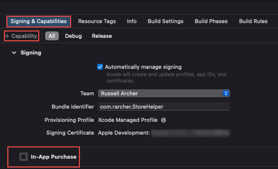
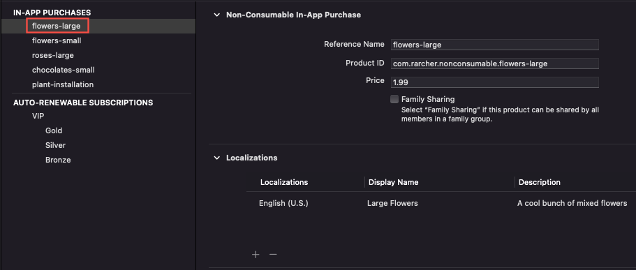
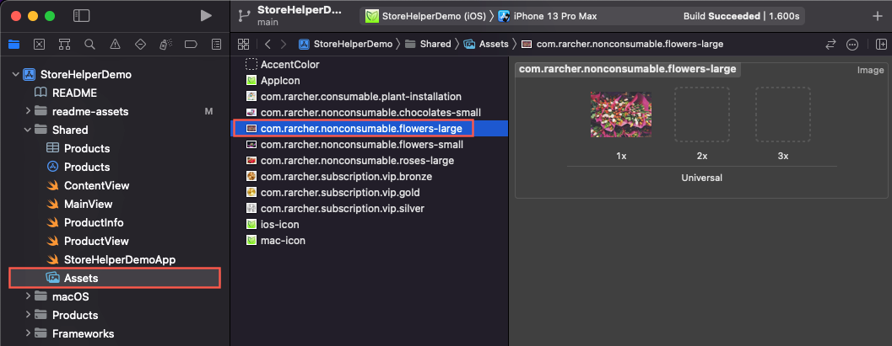
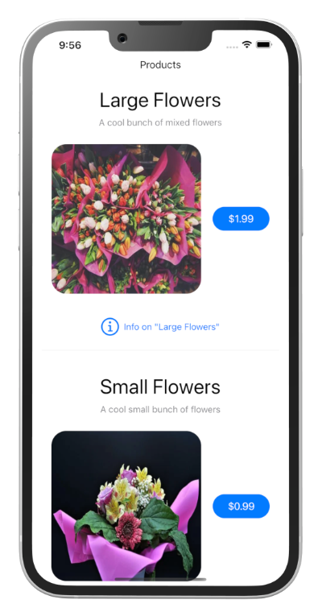
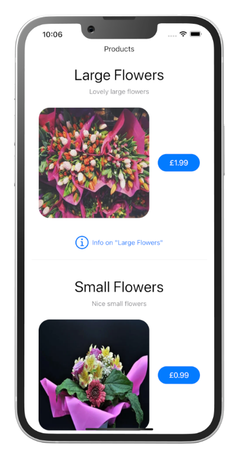
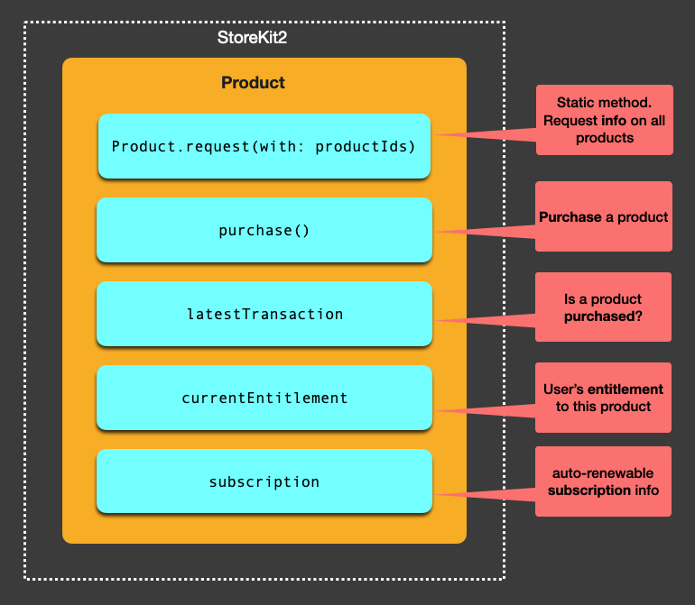
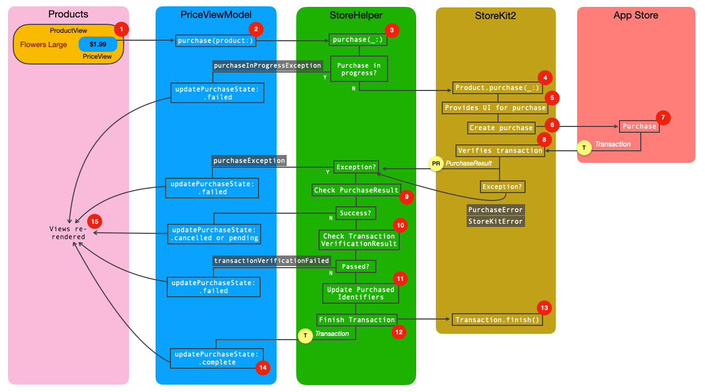
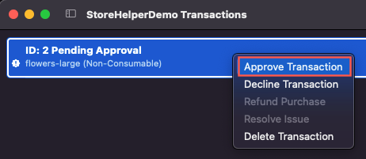

# StoreHelper Demo
Implementing and testing In-App Purchases with `StoreKit2` and `StoreHelper` in Xcode 13, Swift 5.5, iOS 15, macOS 12, tvOS 15 and watchOS 8.

# Description


Implementing and testing In-App Purchases with `StoreKit2` and `StoreHelper` in Xcode 13, Swift 5.5, iOS 15, macOS 12, tvOS 15 and watchOS 8.
See [In-App Purchases with Xcode 12 and iOS 14](https://github.com/russell-archer/IAPDemo) for details of working with the StoreKit1 in iOS 14 and lower.

> This app requires StoreKit2, Swift 5.5, Xcode 13 and iOS 15.
> See [In-App Purchases with Xcode 12 and iOS 14](https://github.com/russell-archer/IAPDemo) for details of working with the original StoreKit1 in iOS 14 and lower.

# Source Code
See [StoreHelperDemo on GitHub](https://github.com/russell-archer/StoreHelper) for source code. 

> **Disclaimer**. The source code presented here is for educational purposes. 
> You may freely reuse and amend this code for use in your own apps. However, you do so entirely at your own risk.

# Contents
- [References](#References)
- [Overview](#Overview)
- [What's changed from the original StoreKit?](#What's-changed-from-the-original-StoreKit)
	- [Receipt validation](#Receipt-validation)
	- [Async Await support](#Async-Await-support)
	- [Should I use StoreKit1 or StoreKit2?](#Should-I-use-StoreKit1-or-StoreKit2)
- [StoreHelperDemo App](#StoreHelperDemo-App)
	- [Get Started](#Get-Started)
	- [Defining our Products](#Defining-our-Products)
	- [Create the StoreKit configuration file](#Create-the-StoreKit-configuration-file)
	- [Enable StoreKit Testing via the Project Scheme](#Enable-StoreKit-Testing-via-the-Project-Scheme)
	- [Creating a Production Product List](#Creating-a-Production-Product-List)
	- [StoreHelper](#StoreHelper)
	- [Displaying Products](#Displaying-Products)
	- [The Product type](#The-Product-type)
	- [Purchasing Products](#Purchasing-Products)
        - [Designing the UI](#Designing-the-UI)
        - [Adding support to StoreHelper](#Adding-support-to-StoreHelper)
	- [Validating Transactions](#Validating-Transactions)
	- [Ask-to-buy support](#Ask-to-buy-support)
	- [What Products has the user purchased](#What-Products-has-the-user-purchased)   
 - [What Next](#What-Next)   

# References
- https://developer.apple.com/documentation/storekit/in-app_purchase
- https://developer.apple.com/documentation/storekit/choosing_a_storekit_api_for_in-app_purchase
- https://developer.apple.com/documentation/storekit/in-app_purchase/implementing_a_store_in_your_app_using_the_storekit_api
- https://developer.apple.com/design/human-interface-guidelines/in-app-purchase/overview/introduction/
- https://developer.apple.com/videos/play/wwdc2021/10175 
- https://developer.apple.com/videos/play/wwdc2021/10114/
- https://developer.apple.com/support/universal-purchase/

---

# Overview


This SwiftUI app will demonstrate how to use Apple's new `StoreKit2` framework to provide in-app purchases to your users. 

The basic premise of the demo is that we're creating an app for an on-line florist that sells a range of flowers, chocolates and other related services 
like home visits to water and care for house plants.

Specifically, in building the app we'll cover:

- How to create a **multi-platform** SwiftUI app that allows users to purchase a range of products, including:

	- **consumable** (VIP plant installation service: lasts for one day)
	- **non-consumable** (cut flowers, potted plants, chocolates, etc.), and 
	- **subscription** (VIP plant home care: scheduled home visits to water and care for house plants)

- Creating a `StoreHelper` that encapsulates `StoreKit2` in-app purchase functionality and makes it easy to work with the App Store
- Requesting localized **product information** from the App Store
- How to **purchase** a product and **validate the transaction**
- Handling **pending ("ask to buy") transactions** where parental permission must be obtained before a purchase is completed
- Handling **canceled** and **failed transactions**
- Automatically handling customer **refunds**
- Exploring detailed **transaction information and history**
- Testing purchases locally using **StoreKit configuration** files

# What's changed from the original StoreKit?
There are two **huge** changes from the previous (original) version of StoreKit (`StoreKit1` hereafter):

## Receipt validation
With `StoreKit1` validating the receipt issued by the App Store was a tricky process that required either:

- Working with the C-based `OpenSSL` library to decrypt, read and validate receipt data (on-device validation)
- Setting up an app server to communicate with the App Store server (server-based validation)

See [In-App Purchases with Xcode 12 and iOS 14](https://github.com/russell-archer/IAPDemo) for more details.

`StoreKit2` now uses the industry-standard JSON Web Signature (`JWS`) format as a secure container for transaction information signed by the App Store:

- JWS is easy to read - no need for a third-party cryptography library!
- Better still, transactions are now **automatically** validated by `StoreKit2`!!

## Async/Await support
`StoreKit1` used a closure-based method of working with async APIs and notifications:

- This led to code that was difficult to read, with program flow being somewhat disjointed

`StoreKit2` fully embraces the `Async`/`Await` pattern introduced in Swift 5.5, Xcode 13 and iOS 15:

- This makes working with async APIs much easier and results in a more "natural" flow to your code

## Should I use StoreKit1 or StoreKit2?
Working with in-app purchases using `StoreKit2` is a vastly superior experience over using `StoreKit1` and you should choose to use it possible.
However, `StoreKit2` requires that your app targets **iOS 15/macOS 12**. If you need to support iOS 14 and lower you'll need to continue using `StoreKit1`.

Apple provides [documentation](https://developer.apple.com/documentation/storekit/choosing_a_storekit_api_for_in-app_purchase) to help you decide which 
version of StoreKit is right for your app.

The good news is that although there are two versions of the StoreKit, both frameworks share a common App Store backend:

- Both versions of StoreKit provide access to the same in-app purchase product data you configure in the App Store
- Both versions of StoreKit provide the exact same UI experience for users
- Transactions made with one version of StoreKit are immediately available in the other version

# StoreHelperDemo App
The best way to get familiar with `StoreKit2` is to create a simple, but full-featured demo app. 
I'll introduce features in an as-required manner as we build the app from it's simplest form to a fully-functional demo.

## Get Started
`StoreHelperDemo` was created using Xcode 13 (beta) and the multi-platform app template.

To get started, here's the structure of the Xcode project after creating empty group folders but before we start adding files. Note that I 
moved `ContentView.swift` into the `Shared/Views` folder and `StoreHelperApp.swift` and the `Assets` catalog into the `Shared/Support` folder:


Check that your iOS and macOS targets support iOS 15 and macOS 12 respectively:


For both targets, add the **In-App Purchase** capability. This will also add the `StoreKit` framework to your project:



## Defining our Products
Before we do anything else we need to define the products we'll be selling. Ultimately this will be done in App Store Connect. However, testing 
in-app purchases (IAPs) using an **App Store Sandbox** environment takes quite a bit of setting up and is rather frustrating to work with. 

> The sandbox test environment requires you to create multiple **sandbox test accounts** in App Store Connect. Each sandbox account has to have a unique email address and be validated as an AppleID. In addition, tests must be on a real device, not the simulator.
> 
> On the test device you need to sign out of your normal AppleID and sign-in using the sandbox account. This really means you need a spare device to do testing on. To make things more painful, each time you make a purchase using a sandbox account that account becomes “used up” and can’t be used to re-purchase the same product. There’s no way to clear purchases, so you need to use a fresh sandbox account for each set of product purchases.

Fortunately, there's now a much better way.

Introduced in Xcode 12 a new **local** StoreKit test environment allows you to do early testing of IAPs in the simulator without having to set 
anything up in App Store Connect. You define your products locally in a **StoreKit Configuration** file. Furthermore, you can view and delete 
transactions, issue refunds, and a whole lot more. There’s also a new `StoreKitTest` framework that enables you to do automated testing of IAPs 
which we'll use later on. We'll use this approach to test IAPs in our app.

## Create the StoreKit configuration file
Select **File > New > File** and choose the **StoreKit Configuration File** template:


Save the file as `Products.storekit` in the `Shared/Configuration` folder.

Open the Products configuration file and click **+** to add an in-app purchase. For example, select the **Add Non-Consumable In-App Purchase** option:


You can now define your products in the StoreKit configuration file. For now we'll create four non-consumable products:



```stylus
Type			: NonConsumable
ReferenceName 		: flowers-large
ProductID 		: com.rarcher.nonconsumable.flowers-large
Price 			: 1.99
FamilyShareable 	: true
Locale 			: en_US
DisplayName 		: Flowers Large
Description 		: A cool bunch of mixed flowers

Type			: NonConsumable
ReferenceName 		: flowers-small
ProductID 		: com.rarcher.nonconsumable.flowers-small
Price 			: 0.99
FamilyShareable 	: false
Locale 			: en_US
DisplayName 		: Flowers Small
Description 		: A cool small bunch of flowers

Type			: NonConsumable
ReferenceName 		: roses-large
ProductID 			: com.rarcher.nonconsumable.roses-large
Price 			: 2.99
FamilyShareable 	: false
Locale 			: en_US
DisplayName 		: Roses Large
Description 		: A large bunch of red roses

Type			: NonConsumable
ReferenceName 		: chocolates-small
ProductID 			: com.rarcher.nonconsumable.chocolates-small
Price 			: 3.99
FamilyShareable 	: true
Locale 			: en_US
Description 		: A small box of chocolates
DisplayName 		: Chocolates Small
```

- **Type**
The type of product (Non-Consumable, Consumable, Non-Renewing, Auto-Renewing).

- **Reference Name** 
A short descriptive reference for the product. Not visible to users.

- **Product ID** 
The unique code used to identify an IAP product. This same ID will be used in App Store Connect when setting up in-app purchases for production. Note that Product ID is a string that, by convention, uses the format “com.developer.product”, although it can be anything you like. Not visible to users.

- **Price** 
A hard-coded price for the product. In production your app will request localized price (and other) information from the App Store. Visible to users.

- **Family Shareable**
True if purchases can be shared by family members, false otherwise. Visible to users.

- **Locale**
By default, the first localization is for the US store. This is used if no other localizations are defined. You can add as many localizations as required. Visible to users.

- **Description**
A short description of the product. Visible to users.

- **Display Name**
The name for the product that users see.

> Note that none of the data defined in the .storekit file is ever uploaded to App Store Connect. It’s only used when testing in-app purchases locally in Xcode.

## Enable StoreKit Testing via the Project Scheme
You now need to enable StoreKit testing in Xcode (it’s disabled by default).

Select **Product > Scheme > Edit Scheme**. Now select **Run** and the **Options** tab. You can now select your configuration file from the **StoreKit Configuration** list:


You'll need to do this for both targets (iOS and macOS).

Should you wish to disable StoreKit testing then repeat the above steps and remove the StoreKit configuration file from the **StoreKit Configuration** list.

## Creating a Production Product List
We'll see shortly how one of the first things our app has to do on starting is request localized product information from the App Store (this is the case 
both when using the local StoreKit test environment and the App Store release environment). This requires a list of our product identifiers. We've defined 
our products in the StoreKit configuration file, so it seems obvious that we should use that as the repository for our IAP data. Retrieving config data 
at runtime isn't difficult (it's `JSON`). However, the StoreKit configuration file is intended for use *when testing* and it's not a good idea to use it 
for production too. It would be all too easy to allow "test products" to make it into the release build!

So, we'll define a plain list of our product identifiers in a property list.

Create a new property list named "**Products.plist**", save it to the `Shared/Configuration` folder and add the product identifiers:

```xml
<plist version="1.0">
<dict>
    <key>Products</key>
    <array>
        <string>com.rarcher.nonconsumable.flowers-large</string>
        <string>com.rarcher.nonconsumable.flowers-small</string>
        <string>com.rarcher.nonconsumable.roses-large</string>
        <string>com.rarcher.nonconsumable.chocolates-small</string>
    </array>
</dict>
</plist>
```

To help us read the property list we'll create a `Configuration` struct with a single `public static` method. Save the `Configuration.swift` 
file in the `Shared/Configuration` folder:

```swift
import Foundation

/// Provides static methods for reading plist configuration files.
public struct Configuration {
    
    private init() {}
    
    /// Read the contents of the product definition property list.
    /// - Returns: Returns a set of ProductId if the list was read, nil otherwise.
    public static func readConfigFile() -> Set<ProductId>? {
        
        guard let result = Configuration.readPropertyFile(filename: StoreConstants.ConfigFile) else {
            StoreLog.event(.configurationNotFound)
            StoreLog.event(.configurationFailure)
            return nil
        }
        
        guard result.count > 0 else {
            StoreLog.event(.configurationEmpty)
            StoreLog.event(.configurationFailure)
            return nil
        }
        
        guard let values = result[StoreConstants.ConfigFile] as? [String] else {
            StoreLog.event(.configurationEmpty)
            StoreLog.event(.configurationFailure)
            return nil
        }
        
        StoreLog.event(.configurationSuccess)

        return Set<ProductId>(values.compactMap { $0 })
    }
    
    /// Read a plist property file and return a dictionary of values
    private static func readPropertyFile(filename: String) -> [String : AnyObject]? {
        
        if let path = Bundle.main.path(forResource: filename, ofType: "plist") {
            if let contents = NSDictionary(contentsOfFile: path) as? [String : AnyObject] {
                return contents
            }
        }
        
        return nil  // [:]
    }
}
```

## Logging
While researching and testing StoreKit2 I found it really helpful to see informational messages about what's going. Rather than use `print()` 
statements I created a simple logging struct that would work for both debug and release builds.

```swift
//
//  StoreLog.swift
//  StoreHelper
//
//  Created by Russell Archer on 16/06/2021.
//

import Foundation
import os.log

/// We use Apple's unified logging system to log errors, notifications and general messages.
/// This system works on simulators and real devices for both debug and release builds.
/// You can view the logs in the Console app by selecting the test device in the left console pane.
/// If running on the simulator, select the machine the simulator is running on. Type your app's
/// bundle identifier into the search field and then narrow the results by selecting "SUBSYSTEM"
/// from the search field's filter. Logs also appear in Xcode's console in the same manner as
/// print statements.
///
/// When running the app on a real device that's not attached to the Xcode debugger,
/// dynamic strings (i.e. the error, event or message parameter you send to the event() function)
/// will not be publicly viewable. They're automatically redacted with the word "private" in the
/// console. This prevents the accidental logging of potentially sensistive user data. Because
/// we know in advance that StoreNotificaton enums do NOT contain sensitive information, we let the
/// unified logging system know it's OK to log these strings through the use of the "%{public}s"
/// keyword. However, we don't know what the event(message:) function will be used to display,
/// so its logs will be redacted.
public struct StoreLog {
    private static let storeLog = OSLog(subsystem: Bundle.main.bundleIdentifier!, category: "STORE")
    
    /// Logs a StoreNotification. Note that the text (shortDescription) of the log entry will be
    /// publically available in the Console app.
    /// - Parameter event: A StoreNotification.
    public static func event(_ event: StoreNotification) {
        #if DEBUG
        print(event.shortDescription())
        #else
        os_log("%{public}s", log: storeLog, type: .default, event.shortDescription())
        #endif
    }
    
    /// Logs an StoreNotification. Note that the text (shortDescription) and the productId for the
    /// log entry will be publically available in the Console app.
    /// - Parameters:
    ///   - event:      A StoreNotification.
    ///   - productId:  A ProductId associated with the event.
    public static func event(_ event: StoreNotification, productId: ProductId) {
        #if DEBUG
        print("\(event.shortDescription()) for product \(productId)")
        #else
        os_log("%{public}s for product %{public}s", log: storeLog, type: .default, event.shortDescription(), productId)
        #endif
    }
    
    /// Logs a message.
    /// - Parameter message: The message to log.
    public static func event(_ message: String) {
        #if DEBUG
        print(message)
        #else
        os_log("%s", log: storeLog, type: .info, message)
        #endif
    }
}
```

## StoreHelper
So that we have some products to display, we'll create a minimal version of the `StoreHelper` class before we focus on the UI. 
Save the `StoreHelper.swift` file in `Shared/StoreHelper`:

```swift
//
//  StoreHelper.swift
//  StoreHelper
//
//  Created by Russell Archer on 16/06/2021.
//

import StoreKit

public typealias ProductId = String

/// StoreHelper encapsulates StoreKit2 in-app purchase functionality and makes it easy to work with the App Store.
@available(iOS 15.0, macOS 12.0, tvOS 15.0, watchOS 8.0, *)
class StoreHelper: ObservableObject {
    
    /// List of `Product` retrieved from the App Store and available for purchase.
    @Published private(set) var products: [Product]?
    
    /// True if we have a list of `Product` returned to us by the App Store.
    public var hasProducts: Bool {
        guard products != nil else { return false }
        return products!.count > 0 ? true : false
    }
    
    /// StoreHelper enables support for working with in-app purchases and StoreKit2 using the async/await pattern.
    init() {
        
        // Read our list of product ids
        if let productIds = Configuration.readConfigFile() {
            
            // Get localized product info from the App Store
            StoreLog.event(.requestProductsStarted)
            async {
                
                products = await requestProductsFromAppStore(productIds: productIds)
                
                if products == nil, products?.count == 0 { StoreLog.event(.requestProductsFailure) } else {
                    StoreLog.event(.requestProductsSuccess)
                }
            }
        }
    }
    
    /// Request localized product info from the App Store for a set of ProductId.
    ///
    /// This method runs on the main thread because it will result in updates to the UI.
    /// - Parameter productIds: The product ids that you want localized information for.
    /// - Returns: Returns an array of `Product`, or nil if no product information is
    /// returned by the App Store.
    @MainActor public func requestProductsFromAppStore(productIds: Set<ProductId>) async -> [Product]? {
        
        try? await Product.request(with: productIds)
    }
}
```

Notice how the initializer reads the products property list to get a set of `ProductId` and then asynchronously calls `requestProductsFromAppStore(productIds:)`, 
which in turn calls the StoreKit `Product.request(with:)` method.

We also have a `@Published` array of `Product`. This array gets updated during the StoreHelper initializer:

```swift
// Get localized product info from the App Store
async { 
	products = await requestProductsFromAppStore(productIds: productIds) 
}
```

The array of products is marked as `@Published` so we can use it to cause our UI to be updated when the array changes.

We can now create a minimal UI that uses `StoreHelper` to request products and then displays them in a `List`.

## Displaying Products
First, we'll add some images for our products to the asset catalog. They're named with the same unique product ids we defined in the `Products.storekit` 
and `Products.plist` files:



Here's our first attempt at a UI to display our products:

```swift
import SwiftUI

struct ContentView: View {
    
    @StateObject var storeHelper = StoreHelper()
    
    var body: some View {
        
        if storeHelper.hasProducts {
            List(storeHelper.products!) { product in
                HStack {
                    Image(product.id)
                        .resizable()
                        .frame(width: 75, height: 75)
                        .aspectRatio(contentMode: .fit)
                        .cornerRadius(25)
                    
                    Text(product.displayName)
                        .font(.title2)
                        .padding()
                    
                    Spacer()
                    
                    Text(product.displayPrice)
                        .font(.title2)
                        .foregroundColor(.blue)
                        .padding()
                }
                .padding()
            }
            .listStyle(.inset)
            
        } else {
            Text("No products")
                .font(.title)
                .foregroundColor(.red)
        }
    }
}

struct ContentView_Previews: PreviewProvider {
    static var previews: some View {
        ContentView()
    }
}
```

We create our `StoreHelper` as a `@StateObject` and check if `storeHelper.hasProducts`. When it does we enumerate `storeHelper.products` in a `List`. 

Running the app's iOS target produces:



And the logging output in the console looks like this:

```text
Configuration success
Request products from the App Store started
Request products from the App Store success
```

Let's be clear about what happens when the app starts:

- Our `StoreHelper` provides `StoreKit` with a list of product ids and asks it to get *localized* product information (notice that prices are in US dollars) for us asynchronously from the App Store
- The App Store returns the requested product info as a `[Product]` and `StoreHelper` saves this in its `@Published` `products` array
- Because our `ContentView` holds `StoreHelper` as a `@StateObject`, when `StoreHelper.products` is updated this causes `ContentView` to be re-rendered and display the product list

The above process works in *exactly* the same way when the app is running in a live production environment and accessing the "real" App Store.


I mentioned above that prices were in US dollars. This is because, by default in test environment, the App Store `Storefront` is **United States (USD)** and 
the localization is **English (US)**. To support testing other locales you can change this. Make sure the `Products.storekit` file is open, then 
select **Editor > Default Storefront** and change this to another value. You can also changed the localization from **English (US**) with **Editor > Default Localization**.

Here I selected **United Kingdom (GBP)** as the storefront and **English (UK)** as the localization. Notice how prices are now in UK Pounds:



In the above screenshot you'll see that, unlike with the US storefront, the UK storefront isn't displaying the product's name. 
If you look at the `Product.storekit` file you'll see that the reason is because I haven't added localizations for the UK.

## The Product type
The `Product` struct is a an important object in `StoreKit`. We've seen how the `static` `Product.request(with:)` method is used to request product information 
from the App Store. It's also used for several other key operations:



## Purchasing Products
### Designing the UI
Let's add the ability to purchase products. This means calling the `purchase()` method on the `Product` object that represents the product we want to purchase.

Our `ContentView` already has a list of products that it's enumerating in a `List`. So, essentially all we need to is add a `Button` and call the product's `purchase(_:)` method:

```swift
List(storeHelper.products!) { product in
	:
	Button(action: {
 		async { let result = try? await product.purchase() }
 	}) {
		Text("Purchase")
 	}	
}
```

Notice how we need to add an `async {...}` block to our button's action closure. This allows us to run async code in a "synchronous context" (the `ContentView`).

To keep the size and complexity of views manageable, I split the various parts of the UI into separate views like this:


- The `ContentView` has a `List` which contains a collection of `ProductView` objects
- Each `ProductView` has an image of the product, the name of the product and a `PurchaseButton` 
- `PurchaseButton` contains a `BadgeView` and a `PriceView`
- `BadgeView` displays a small image showing the state of the purchase state of the product (i.e. purchased, failed, etc.)
- `PriceView` shows the localized price of the product as part of a purchase `Button`. When a product has been purchased the button is not displayed

### Adding support to StoreHelper
We now need to add support for purchasing to `StoreHelper`. The main things to add are:

- A `@Published` `Set` of `ProductId` that holds the ids of purchased products:

```swift
@Published private(set) var purchasedProducts = Set<ProductId>()
```

- A variable that holds the current state of purchasing:

```swift
public enum PurchaseState { case notStarted, inProgress, complete, pending, cancelled, failed, failedVerification, unknown }
public private(set) var purchaseState: PurchaseState = .notStarted
```

- A `purchase(_:)` method (rather than call it directly from the UI, I moved the call to StoreKit's `product.purchase()` method into `StoreHelper`):

```swift
public func purchase(_ product: Product) async throws -> (transaction: Transaction?, purchaseState: PurchaseState)  { ... }
```

- A **task handle** and associated method that enables us to listen for App Store transactions. These transactions are things like resolution of "ask-to-buy" (pending) purchases, refunds, restoring purchases, etc.:

```swift
/// Handle for App Store transactions.
internal var transactionListener: Task.Handle<Void, Error>? = nil
:
init() {
    transactionListener = handleTransactions()
	:
}
:
internal func handleTransactions() -> Task.Handle<Void, Error> { ... }
```

Here's the code for `StoreHelper`. For brevity, all comments and logging statements have been removed. 
You can [browse the full code for `StoreHelper` here on GitHub](https://github.com/russell-archer/StoreHelper/blob/main/Shared/StoreHelper/StoreHelper.swift).

```swift
import StoreKit

public typealias ProductId = String

@available(iOS 15.0, macOS 12.0, tvOS 15.0, watchOS 8.0, *)
public class StoreHelper: ObservableObject {
    @Published private(set) var products: [Product]?
    @Published private(set) var purchasedProducts = Set<ProductId>()
    public private(set) var purchaseState: PurchaseState = .notStarted
    public enum PurchaseState { case notStarted, inProgress, complete, pending, cancelled, failed, failedVerification, unknown }
    internal var transactionListener: Task.Handle<Void, Error>? = nil
    
    init() {
        transactionListener = handleTransactions()
        if let productIds = Configuration.readConfigFile() {
            async {
                products = await requestProductsFromAppStore(productIds: productIds)    
                if products == nil, products?.count == 0 { StoreLog.event(.requestProductsFailure) } 
            }
        }
    }

    @MainActor public func requestProductsFromAppStore(productIds: Set<ProductId>) async -> [Product]? {
        try? await Product.request(with: productIds)
    }
    
    public func isPurchased(product: Product) async throws -> Bool {
        guard let mostRecentTransaction = await product.latestTransaction else { return false }
        
        let checkResult = checkTransactionVerificationResult(result: mostRecentTransaction)
        if !checkResult.verified { throw StoreException.transactionVerificationFailed }

        let validatedTransaction = checkResult.transaction
        await updatePurchasedIdentifiers(validatedTransaction)

        return validatedTransaction.revocationDate == nil && !validatedTransaction.isUpgraded
    }
    
    public func purchase(_ product: Product) async throws -> (transaction: Transaction?, purchaseState: PurchaseState)  {
        guard purchaseState != .inProgress else { throw StoreException.purchaseInProgressException }
        
        purchaseState = .inProgress
        guard let result = try? await product.purchase() else {
            purchaseState = .failed
            throw StoreException.purchaseException
        }

        switch result {
            case .success(let verificationResult):
                let checkResult = checkTransactionVerificationResult(result: verificationResult)
                if !checkResult.verified {
                    purchaseState = .failedVerification
                    throw StoreException.transactionVerificationFailed
                }
                
                let validatedTransaction = checkResult.transaction
                await updatePurchasedIdentifiers(validatedTransaction)
                await validatedTransaction.finish()
                purchaseState = .complete
                return (transaction: validatedTransaction, purchaseState: .complete)
                
            case .userCancelled:
                purchaseState = .cancelled
                return (transaction: nil, .cancelled)
                
            case .pending:
                purchaseState = .pending
                return (transaction: nil, .pending)
                
            default:
                purchaseState = .unknown
                return (transaction: nil, .unknown)
        }
    }
    
    public func product(from productId: ProductId) -> Product? {
        guard products != nil else { return nil }
        let matchingProduct = products!.filter { product in 
			product.id == productId
        }
        
        guard matchingProduct.count == 1 else { return nil }
        return matchingProduct.first
    }
    
    internal func handleTransactions() -> Task.Handle<Void, Error> {
        return detach {
            for await verificationResult in Transaction.listener {
                let checkResult = self.checkTransactionVerificationResult(result: verificationResult)

                if checkResult.verified {
                    let validatedTransaction = checkResult.transaction
                    await self.updatePurchasedIdentifiers(validatedTransaction)
                    await validatedTransaction.finish()
                    
                }
            }
        }
    }

    @MainActor internal func updatePurchasedIdentifiers(_ transaction: Transaction) async {
        if transaction.revocationDate == nil { purchasedProducts.insert(transaction.productID) } 
		else { purchasedProducts.remove(transaction.productID) }
    }
    
    internal func checkTransactionVerificationResult(result: VerificationResult<Transaction>) -> (transaction: Transaction, verified: Bool) {
        switch result {
            case .unverified(let unverifiedTransaction): return (transaction: unverifiedTransaction, verified: false) 
            case .verified(let verifiedTransaction): return (transaction: verifiedTransaction, verified: true)
        }
    }
}
```

We also need to add a **ViewModel** for `PriceView` named `PriceViewModel`:

```swift
import StoreKit
import SwiftUI

struct PriceViewModel {
    @ObservedObject var storeHelper: StoreHelper
    @Binding var purchasing: Bool
    @Binding var cancelled: Bool
    @Binding var pending: Bool
    @Binding var failed: Bool
    @Binding var purchased: Bool
    
    func purchase(product: Product) async {
        do {
            let purchaseResult = try await storeHelper.purchase(product)
            if purchaseResult.transaction != nil { updatePurchaseState(newState: purchaseResult.purchaseState) } 
			else { updatePurchaseState(newState: purchaseResult.purchaseState)  // The user cancelled, or it's pending approval }
        } catch {            
            updatePurchaseState(newState: .failed)  // The purchase or validation failed
        }
    }
    
    private func updatePurchaseState(newState: StoreHelper.PurchaseState) {
        purchasing  = false
        cancelled   = newState == .cancelled
        pending     = newState == .pending
        failed      = newState == .failed
        purchased   = newState == .complete
    }
}
```

## Validating Transactions
A key point to note is how we **validate** transactions. Every time our app receives a transaction (e.g. when a purchase is made) from the App Store 
via `StoreKit`, the transaction has **already passed through a verification process** to confirm whether the transaction is signed by the App Store 
for **this app** for **this device**. 

> That is, Storekit2 does **automatic** transaction ("receipt") verification for you. So, no more using OpenSSL to decrypt and read App Store receipts or sending receipts to an Apple server for verification! 
> 
> Note that the App Store cryptographically secures and signs each transaction using the industry-standard JSON Web Signature (`JWS`) format.  
> 
> The `Transaction` object provides access to the underling JWS as a `String` property, so you may perform your own validation if required (although this probably won't be necessary for most apps).
        
In our `StoreHelper.purchase(_:)` method, we call StoreKit's `product.purchase()` method and get a `PurchaseResult` back that indicates `success`, 
`userCancelled`, or `pending`. The call to `product.purchase()` may also throw an exception, which indicates that the purchase failed.

If the purchase seems to have succeeded (`PurchaseResult == .success`), StoreKit has already automatically attempted to validate the transaction, 
returning the result of this validation wrapped in a `VerificationResult`.

We check the `VerificationResult<Transaction>` to see if the transaction passed or failed the verification process. This is equivalent to receipt 
validation in StoreKit1. 

If the verification process is a success we update our collection of purchased product ids and give the user access to the purchased product.

The simplified purchase process flow (showing mainly the "success" path) is as follows:



1. The user taps the `PriceView` button, which calls `PriceViewModel.purchase(product:)`, passing the `Product` to purchase

2. `PriceViewModel` calls `purchase(_:)` in `StoreHelper`, passing the `Product` to purchase

3. If there's already a purchase in progress, then a `StoreException.purchaseInProgressException` is thrown and caught by `PriceViewModel`

4. `StoreHelper` asynchronously calls `StoreKit.purchase(_:)` and awaits the result

5. `StoreKit` leads the user through the purchase process and provides all the UI required

6. `StoreKit` talks to the App Store to complete the purchase

7. The App Store completes the purchase and sends `StoreKit` a purchase `Transaction` object

8. `StoreKit` verifies that the purchase `Transaction` is correctly signed by the App Store and that the purchase is valid for the current user on the particular device in use. A `Product.PurchaseResult` is returned to `StoreHelper`.
 
	- If `StoreKit` encounters an error then a `StoreKitError` exception is thrown
	- If App Store encounters an error then a `PurchaseError`  exception is thrown
	- Any exceptions are caught by `StoreHelper`, which re-throws a `StoreException.purchaseException`. This will be caught by `PriceViewModel`
    
9. `StoreHelper` checks the `Product.PurchaseResult` returned by StoreKit, if it's a success it...

10. ...checks the `VerificationResult` (which is wrapped up in the `PurchaseResult`). If this results in a valid `Transaction` then...

11. ... the collection of purchase product ids is updated to add the newly purchased product

12. `StoreHelper` tells `StoreKit` the `Transaction` is finished and returns the `Transaction` object to `PriceViewModel`. It sets `@State` variables to show the purchase was a success and the UI is re-rendered

If we run the app we can now make purchases:


## Ask-to-buy support
The App Store supports the concept of "ask-to-buy" purchases, where parents can configure an Apple ID to require their permission to make a purchases. 
When a user makes this type of purchase the `PurchaseResult` returned by StoreKit's `product.purchase()` method will have a value of `.pending`. This
state can also be applicable when a user is required to make banking changes before a purchase is confirmed.

With StoreKit testing we can easily simulate pending purchases to see if our app correctly supports them.

To enable ask-to-buy support in StoreKit select the `.storekit` configuration file and then select **Editor > Enable Ask To Buy**:


Now run the app and attempt to make a purchase. You'll find that the purchase proceeds as normal. 
However, instead of receiving a purchase confirmation you'll see an **Ask Permission** alert. 

Tap **Ask** and you'll see that the purchase enters a `.pending` state, as denoted by the orange hourglass next to the product purchase button:


With the app still running, click the **Manage StoreKit Transaction** button on the Xcode debug area pane:


You'll now be able to see the transaction that is "Pending Approval":


Right-click the transaction that is pending approval and select **Approve Transaction**:



You should see the purchase confirmed as `StoreHelper` processes the transaction:


## What Products has the user purchased?
Everything seems to be working well. However, what happens if we quit and restart the app. How do we know what purchases the user has previously made?

If you stop and re-run the app you'll see that without any work on our part it seems to remember what's been purchased. This is because, as currently 
written, the UI calls `StoreHelper.isPurchased(product:)` for each product when it's displayed. Depending on what's been cached by `StoreKit`, this 
may result in a network call to the App Store.

You can also use `Transaction.currentEntitlements` to get a list of transactions for the user. This includes non-consumable in-app purchases and active subscriptions.

There is a potential problem here: what happens when the network is unavailable and the App Store can't be reached to confirm a user's transactions 
and entitlements? In a real-world app you will need to have some kind of "fall-back" list of purchases (product ids) that gets persisted.

# What Next?
I'll be updating this demo shortly to add support for:

- Handling **subscriptions**
- **Caching** user purchase information, for cases when the network is unavailable and the App Store can't be reached
- Automatically handling customer **refunds**
- Exploring detailed **transaction information and history**
- Multi-platform issues
