# StoreHelper Demo
Implementing and testing In-App Purchases with `StoreKit2` in Xcode 13, Swift 5.5, iOS 15.

See also [In-App Purchases with Xcode 12 and iOS 14](https://github.com/russell-archer/IAPDemo) for details of working with the `StoreKit1` in iOS 14 and lower.

---

# Description


Implementing and testing In-App Purchases with `StoreKit2` in Xcode 13, Swift 5.5, iOS 15 and macOS 12.

> This app requires `StoreKit2`, Swift 5.5, Xcode 13 and iOS 15. 
> 
> See [In-App Purchases with Xcode 12 and iOS 14](https://github.com/russell-archer/IAPDemo) for details of working with the original `StoreKit1` in iOS 14 and lower.

# Xcode 13 Beta Changes
- Beta 5
	- Modified `StoreHelper.checkVerificationResult(result:)` to return `UnwrappedVerificationResult`. 
    This includes a new `VerificationResult<T>.VerificationError` that is provided by StoreKit2 when the unwrapped transaction is unverified
- Beta 4
	- None required
- Beta 3
	- The use of `Task.Handle` has been deprecated
	- The `StoreHelper` transaction listener now has a type of `Task<Void, Error>`
	- The return type for `StoreHelper.handleTransactions()` changed from `Task.Handle<Void, Error>` to `Task<Void, Error>`
	- The `detach` keyword for creating detached tasks has been deprecated
	- The use of `detach` in `StoreHelper.handleTransactions()`  has been replaced with `Task.detached`
	- The use of `async {}` blocks in a synchronous context has been deprecated
	- All `async {}` blocks have been replaced with `Task.init {}`
- Beta 2
	- `Transaction.listener` is now `Transaction.updates`
	- `Product.request(with:)` is now `Product.products(for:)`

---

# Source Code
See [StoreHelperDemo on GitHub](https://github.com/russell-archer/StoreHelper) for source code. 

> **Disclaimer**. The source code presented here is for educational purposes. 
> You may freely reuse and amend this code for use in your own apps. However, you do so entirely at your own risk.

---

# Contents
- [References](#References)
- [Overview](#Overview)
- [What's changed from the original StoreKit?](#What's-changed-from-the-original-StoreKit)
	- [Receipt validation](#Receipt-validation)
	- [Async Await support](#Async-Await-support)
	- [Should I use StoreKit1 or StoreKit2?](#Should-I-use-StoreKit1-or-StoreKit2)
- [StoreHelperDemo App](#StoreHelperDemo-App)
- [Get Started](#Get-Started)
- [Defining our Products](#Defining-our-Products)
- [Create the StoreKit configuration file](#Create-the-StoreKit-configuration-file)
- [Enable StoreKit Testing via the Project Scheme](#Enable-StoreKit-Testing-via-the-Project-Scheme)
- [Creating a Production Product List](#Creating-a-Production-Product-List)
- [Logging](#Logging)
- [StoreHelper](#StoreHelper)
- [Displaying Products](#Displaying-Products)
- [The Product type](#The-Product-type)
- [Purchasing Products](#Purchasing-Products)
       	- [Designing the UI](#Designing-the-UI)
       	- [Adding support to StoreHelper](#Adding-support-to-StoreHelper)
- [Validating Transactions](#Validating-Transactions)
- [Ask-to-buy support](#Ask-to-buy-support)
- [What Products has the user purchased](#What-Products-has-the-user-purchased)
- [Use the Receipt Luke](#Use-the-Receipt-Luke)
- [Consumables](#Consumables)
- [Subscriptions](#Subscriptions)
- [Displaying Purchase Information](#Displaying-Purchase-information)
- [Displaying Subscription Information](#Displaying-Subscription-Information)
- [Upgrades](#Upgrades)
- [Managing Subscriptions](#Managing-Subscriptions)   
- [Refunds](#Refunds)
---

# References
- https://developer.apple.com/in-app-purchase/
- https://developer.apple.com/documentation/storekit/in-app_purchase
- https://developer.apple.com/documentation/storekit/choosing_a_storekit_api_for_in-app_purchase
- https://developer.apple.com/documentation/storekit/in-app_purchase/implementing_a_store_in_your_app_using_the_storekit_api
- https://developer.apple.com/design/human-interface-guidelines/in-app-purchase/overview/introduction/
- https://developer.apple.com/videos/play/wwdc2021/10175 
- https://developer.apple.com/videos/play/wwdc2021/10114/
- https://developer.apple.com/support/universal-purchase/

---

# Overview


This SwiftUI app will demonstrate how to use Apple's new `StoreKit2` framework to provide in-app purchases to your users. 

The basic premise for the demo is that we're creating an app for an on-line florist that sells a range of flowers, chocolates and other related services like home visits to water and care for house plants.

Specifically, in building the app we'll cover:

- How to create a **multi-platform** SwiftUI app that allows users to purchase a range of products, including:

	- **consumable** (VIP plant installation service: lasts for one day)
	- **non-consumable** (cut flowers, potted plants, chocolates, etc.)
	- **subscription** (VIP plant home care: scheduled home visits to water and care for house plants)

- Creating a `StoreHelper` that encapsulates `StoreKit2` in-app purchase functionality and makes it easy to work with the App Store
- Requesting localized **product information** from the App Store
- How to **purchase** a product and **validate the transaction**
- Handling **pending ("ask to buy") transactions** where parental permission must be obtained before a purchase is completed
- Handling **canceled** and **failed transactions**
- Handling customer **refunds**
- Exploring detailed **transaction information and history** for non-consumables and subscriptions
- Testing purchases locally using **StoreKit configuration** files

# What's changed from the original StoreKit?
There are two **huge** changes from the previous (original) version of StoreKit (`StoreKit1` hereafter):

## Receipt validation
With `StoreKit1` validating the receipt issued by the App Store was a tricky process that required either:

- Working with the C-based `OpenSSL` library to decrypt, read and validate receipt data (on-device validation)
- Setting up an app server to communicate with the App Store server (server-based validation)

See [In-App Purchases with Xcode 12 and iOS 14](https://github.com/russell-archer/IAPDemo) for more details.

`StoreKit2` now uses the industry-standard JSON Web Signature (`JWS`) format as a secure container for transaction information signed by the App Store:

- JWS is easy to read - no need for a third-party cryptography library!
- Better still, transactions are now **automatically** validated by `StoreKit2`!!

## Async/Await support
`StoreKit1` uses a closure-based method of working with async APIs and notifications:

- This leads to code that is difficult to read, with program flow being somewhat disjointed

`StoreKit2` fully embraces the new `Async`/`Await` pattern introduced in Swift 5.5, Xcode 13 and iOS 15:

- This makes working with async APIs much easier and results in a more "natural" flow to your code

## Should I use StoreKit1 or StoreKit2?
Working with in-app purchases using `StoreKit2` is a vastly superior experience over using `StoreKit1` and you should choose to use it if possible.
However, `StoreKit2` requires that your app targets **iOS 15/macOS 12**. If you need to support iOS 14 and lower you'll need to continue using `StoreKit1`.

Apple provides [documentation](https://developer.apple.com/documentation/storekit/choosing_a_storekit_api_for_in-app_purchase) to help you decide which version of StoreKit is right for your app.

The good news is that although there are two versions of the StoreKit, both frameworks share a common App Store backend:

- Both versions of StoreKit provide access to the same in-app purchase product data you configure in the App Store
- Both versions of StoreKit provide the exact same UI experience for users
- Transactions made with one version of StoreKit are immediately available in the other version

# StoreHelperDemo App
The best way to get familiar with `StoreKit2` is to create a simple, but full-featured (from an in-app purchase perspective) demo app. I'll introduce features in an as-required manner as we build the app from it's simplest form to a fully-functional demo.

# Get Started
`StoreHelperDemo` was created using Xcode 13 (beta) and the multi-platform app template.

To get started, here's the structure of the Xcode project after creating empty group folders but before we start adding files. Note that I moved `ContentView.swift` into the `Shared/Views` folder and `StoreHelperApp.swift` and the `Assets` catalog into the `Shared/Support` folder:


Check that your iOS and macOS targets support iOS 15 and macOS 12 respectively:


For both targets, add the **In-App Purchase** capability. This will also add the `StoreKit` framework to your project:


# Defining our Products
Before we do anything else we need to define the products we'll be selling. Ultimately this will be done in App Store Connect. However, testing in-app purchases (IAPs) using an **App Store Sandbox** environment takes quite a bit of setting up and is rather frustrating to work with. 

> The sandbox test environment requires you to create multiple **sandbox test accounts** in App Store Connect. Each sandbox account has to have a unique email address and be validated as an AppleID. In addition, tests must be on a real device, not the simulator.
> 
> On the test device you need to sign out of your normal AppleID and sign-in using the sandbox account. This really means you need a spare device to do testing on. 
> 
> Prior to WWDC21, using the sandbox test environment was pretty painful. Each time you made a purchase using a sandbox account that account became “used up” and couldn't be used to re-purchase the same product. There was no way to clear purchases and you had to use a fresh sandbox account for each set of product purchases! Happily, post-WWDC21 you can now reset a user's purchases, change the account region and adjust renewal rates!

Fortunately, there's now a much better way.

Introduced in Xcode 12 a new **local** StoreKit test environment allows you to do early testing of IAPs in the simulator without having to set anything up in App Store Connect. You define your products locally in a **StoreKit Configuration** file. Furthermore, you can view and delete transactions, issue refunds, and a whole lot more. There’s also a new `StoreKitTest` framework that enables you to do automated testing of IAPs. We'll use this approach to test IAPs in our app.

# Create the StoreKit configuration file
Select **File > New > File** and choose the **StoreKit Configuration File** template:

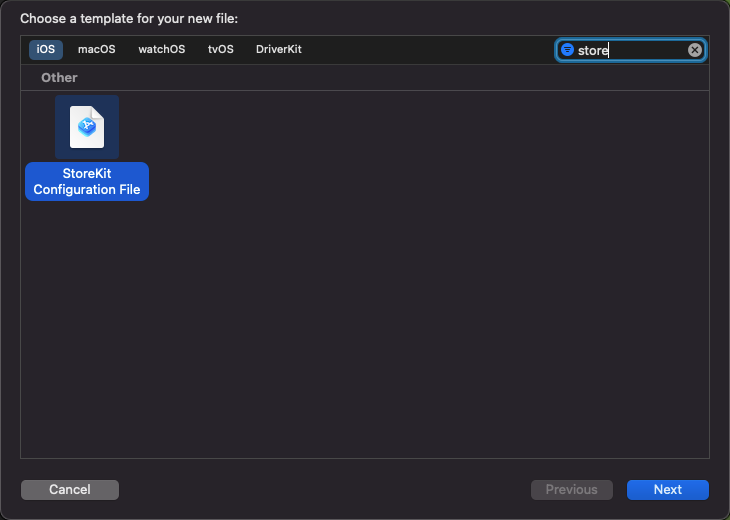

Save the file as `Products.storekit` in the `Shared/Configuration` folder.

Open the Products configuration file and click **+** to add an in-app purchase. For example, select the **Add Non-Consumable In-App Purchase** option:


You can now define your products in the StoreKit configuration file. For now we'll create four non-consumable products:


| Type | Reference Name | Product ID | Price | Family Shareable | Locale | Display Name | Description |
| --- | --- | ---| --- | --- | --- | --- | --- | 
| Non-Consumable | flowers-large | com.rarcher.nonconsumable.flowers-large | 1.99 | true | en_US | Flowers Large | A cool bunch of mixed flowers |
| Non-Consumable | flowers-small | com.rarcher.nonconsumable.flowers-small | 0.99 | false | en_US | Flowers Small | A cool small bunch of flowers |
| Non-Consumable | roses-large | com.rarcher.nonconsumable.roses-large | 2.99 | false | en_US | Roses Large | A large bunch of red roses |
| Non-Consumable | chocolates-small | com.rarcher.nonconsumable.chocolates-small | 3.99 | true | en_US | A small box of chocolates | Chocolates Small |

- **Type**
The type of product (Non-Consumable, Consumable, Non-Renewing, Auto-Renewing).

- **Reference Name** 
A short descriptive reference for the product. Not visible to users.

- **Product ID** 
The unique code used to identify an IAP product. This same ID will be used in App Store Connect when setting up in-app purchases for production. 
Note that Product ID is a string that, by convention, uses the format *com.developer.product-type.product-name*, although it can be anything you like. 
Not visible to users.

- **Price** 
A hard-coded price for the product. In production your app will request localized price (and other) information from the App Store. Visible to users.

- **Family Shareable**
True if purchases can be shared by family members, false otherwise. Visible to users.

- **Locale**
By default, the first localization is for the US store. This is used if no other localizations are defined. You can add as many localizations as required. Visible to users.

- **Description**
A short description of the product. Visible to users.

- **Display Name**
The name for the product that users see.

> Note that none of the data defined in the .storekit file is ever uploaded to App Store Connect. It’s only used when testing in-app purchases locally in Xcode.

# Enable StoreKit Testing via the Project Scheme
You now need to enable StoreKit testing in Xcode as it’s disabled by default.

Select **Product > Scheme > Edit Scheme**. 
Now select **Run** and the **Options** tab. 
You can now select your configuration file from the **StoreKit Configuration** list:

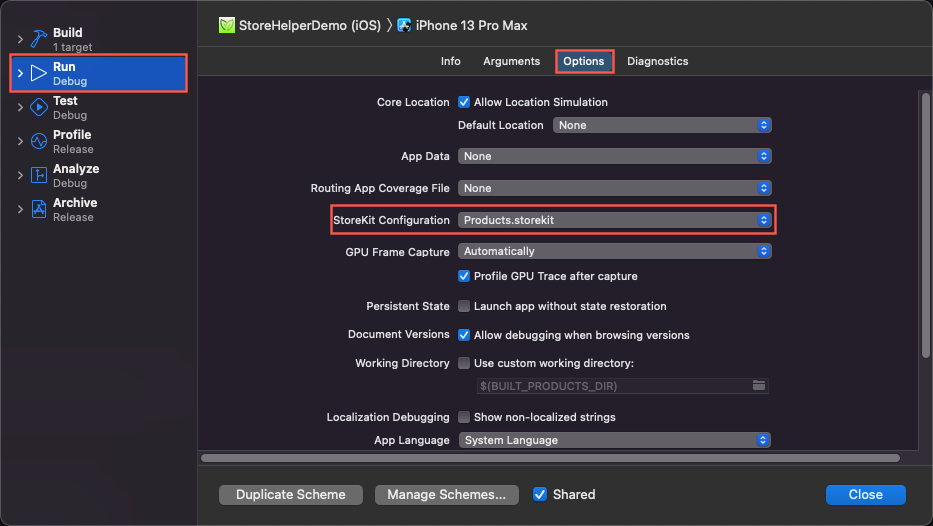

You'll need to do this for both targets (iOS and macOS).

Should you wish to disable StoreKit testing then repeat the above steps and remove the StoreKit configuration file from the **StoreKit Configuration** list.

# Creating a Production Product List
We'll see shortly how one of the first things our app has to do on starting is request localized product information from the App Store. This is the case both when 
using the local StoreKit test environment and the App Store release environment. This requires a list of our product identifiers. We've defined our products in the 
StoreKit configuration file, so it seems obvious that we should use that as the repository for our IAP data. Retrieving config data at runtime isn't difficult 
(it's `JSON`). However, the StoreKit configuration file is intended for use *when testing* and it's not a good idea to use it for production too. It would be all 
too easy to allow "test products" to make it into the release build!

So, we'll define a list of our product identifiers in a property list.

Create a new property list named "**Products.plist**", save it to the `Shared/Configuration` folder and add the product identifiers:

```xml
<plist version="1.0">
<dict>
    <key>Products</key>
    <array>
        <string>com.rarcher.nonconsumable.flowers-large</string>
        <string>com.rarcher.nonconsumable.flowers-small</string>
        <string>com.rarcher.nonconsumable.roses-large</string>
        <string>com.rarcher.nonconsumable.chocolates-small</string>
    </array>
</dict>
</plist>
```

To help us read the property list we'll create a `Configuration` struct with a single `public static` method. Save the `Configuration.swift` file in 
the `Shared/Configuration` folder:

```swift
import Foundation

public struct Configuration {
    
    private init() {}
    
    public static func readConfigFile() -> Set<ProductId>? {
        
        guard let result = Configuration.readPropertyFile(filename: StoreConstants.ConfigFile) else {
            return nil
        }

        return Set<ProductId>(values.compactMap { $0 })
    }
    
    private static func readPropertyFile(filename: String) -> [String : AnyObject]? {
        
        if let path = Bundle.main.path(forResource: filename, ofType: "plist") {
            if let contents = NSDictionary(contentsOfFile: path) as? [String : AnyObject] {
                return contents
            }
        }
        
        return nil  // [:]
    }
}
```

# Logging
While researching and testing `StoreKit2` I found it really helpful to see informational messages about what's going. Rather than use `print()` statements I created a simple logging `StoreLog` struct that would work for both debug and release builds.

I use Apple's unified logging system to log errors, notifications and general messages. This system works on simulators and real devices for both debug and release builds. You can view the logs in the Console app by selecting the test device in the left console pane.

If running on the simulator, select the machine the simulator is running on. Type your app's bundle identifier into the search field and then narrow the results by selecting "SUBSYSTEM" from the search field's filter. Logs also appear in Xcode's console in the same manner as print statements.

When running the app on a real device that's not attached to the Xcode debugger, dynamic strings (i.e. the error, event or message parameter you send to the event() function) will not be publicly viewable. They're automatically redacted with the word "private" in the console. This prevents the accidental logging of potentially sensitive user data. Because we know in advance that `StoreNotificaton` enums do not contain sensitive information, we let the unified logging system know it's OK to log these strings through the use of the "%{public}s" keyword. However, we don't know what the event(message:) function will be used to display, so its logs will be redacted.

# StoreHelper
So that we have some products to display, we'll create a minimal version of the `StoreHelper` class before we focus on the UI. Save the `StoreHelper.swift` file in `Shared/StoreHelper`:

```swift
import StoreKit
public typealias ProductId = String

@available(iOS 15.0, macOS 12.0, *)
class StoreHelper: ObservableObject {
    
    @Published private(set) var products: [Product]?
    
    init() {
        if let productIds = Configuration.readConfigFile() {
            // Get localized product info from the App Store
            Task.init { products = await requestProductsFromAppStore(productIds: productIds) }
        }
    }
    
    @MainActor public func requestProductsFromAppStore(productIds: Set<ProductId>) async -> [Product]? {
        try? await Product.products(for: productIds)
    }
}
```

Notice how the initializer reads the `Products.plist` property list to get a set of `ProductId` and then asynchronously calls `requestProductsFromAppStore(productIds:)`, which in turn calls the `StoreKit2` `Product.products(for:)` method.

We also have a `@Published` array of `Product`. This array gets updated during the StoreHelper initializer:

```swift
// Get localized product info from the App Store
Task.init { products = await requestProductsFromAppStore(productIds: productIds) }
```

The array of products is marked as `@Published` so we can use it to cause our UI to be updated when the array changes.

We can now create a minimal UI that uses `StoreHelper` to request products and then displays them in a `List`.

# Displaying Products
First, we'll add some images for our products to the asset catalog. They're named with the same unique product ids we defined in the `Products.storekit` and `Products.plist` files:


Here's our first attempt at a UI to display our products:

```swift
import SwiftUI

struct ContentView: View {
    @StateObject var storeHelper = StoreHelper()
    
    var body: some View {
        if storeHelper.hasProducts {
            List(storeHelper.products!) { product in
                HStack {
                    Image(product.id)
                        .resizable()
                        .frame(width: 75, height: 75)
                        .aspectRatio(contentMode: .fit)
                        .cornerRadius(25)
                    
                    Text(product.displayName)
                        .font(.title2)
                        .padding()
                    
                    Spacer()
                    
                    Text(product.displayPrice)
                        .font(.title2)
                        .foregroundColor(.blue)
                        .padding()
                }
                .padding()
            }
            .listStyle(.inset)
            
        } else {
            Text("No products")
                .font(.title)
                .foregroundColor(.red)
        }
    }
}
```

We create our `StoreHelper` as a `@StateObject` and check if `storeHelper.hasProducts`. When it does we enumerate `storeHelper.products` in a `List`. 

Running the app's iOS target produces:


And the logging output in the console looks like this:

```text
Configuration success
Request products from the App Store started
Request products from the App Store success
```

Let's be clear about what happens when the app starts:

- Our `StoreHelper` provides `StoreKit2` with a list of product ids and asks it to get *localized* product information asynchronously from the App Store
- The App Store returns the requested product info as a `[Product]` and `StoreHelper` saves this in its `@Published` `products` array
- Because our `ContentView` holds `StoreHelper` as a `@StateObject`, when `StoreHelper.products` is updated this causes `ContentView` to be re-rendered and display the product list

The above process works in *exactly* the same way when the app is running in a live production environment and accessing the "real" App Store.

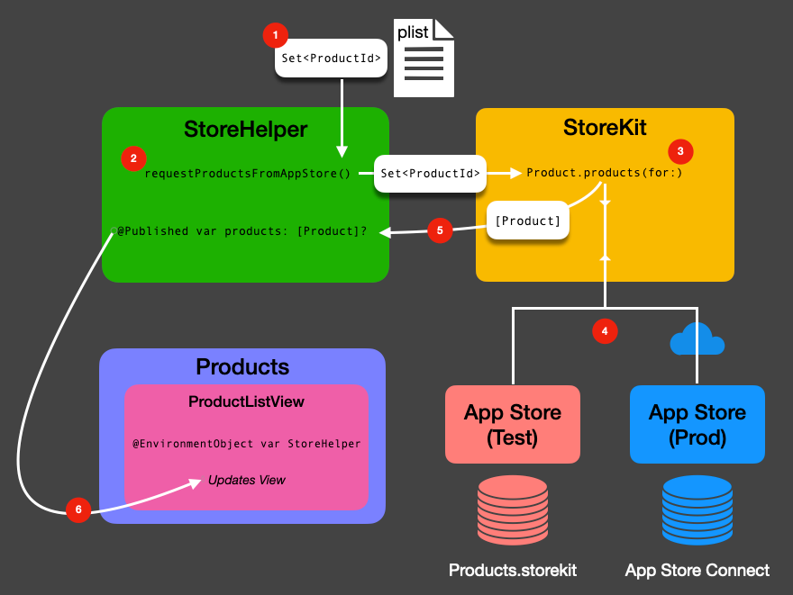

I mentioned above that prices were in US dollars. This is because, by default in test environment, the App Store `Storefront` is **United States (USD)** and the localization is **English (US)**. To support testing other locales you can change this. Make sure the `Products.storekit` file is open, then select **Editor > Default Storefront** and change this to another value. You can also changed the localization from **English (US**) with **Editor > Default Localization**.

Here I selected **United Kingdom (GBP)** as the storefront and **English (UK)** as the localization. Notice how prices are now in UK Pounds:


In the above screenshot you'll see that, unlike with the US storefront, the UK storefront isn't displaying the product's name. If you look at the `Product.storekit` file you'll see that the reason is because I haven't added localizations for the UK.

# The Product type
The `Product` struct is a an important object in `StoreKit2`. We've seen how the `static` `Product.products(for:)` method is used to request product information from the App Store. It's also used for several other key operations:


# Purchasing Products
## Designing the UI
Let's add the ability to purchase products. This means calling the `purchase()` method on the `Product` object that represents the product we want to purchase.

Our `ContentView` already has a list of products that it's enumerating in a `List`. So, essentially all we need to is add a `Button` and call the product's `purchase(_:)` method:

```swift
List(storeHelper.products!) { product in

	Button(action: {
        Task.init { let result = try? await product.purchase() }
 	}) {
        Text("Purchase")
 	}	
}
```

Notice how we need to add an `Task.init {...}` block to our button's action closure. This allows us to run async code in a "synchronous context" (the `ContentView`).

To keep the size and complexity of views manageable, I split the various parts of the UI into separate views like this:

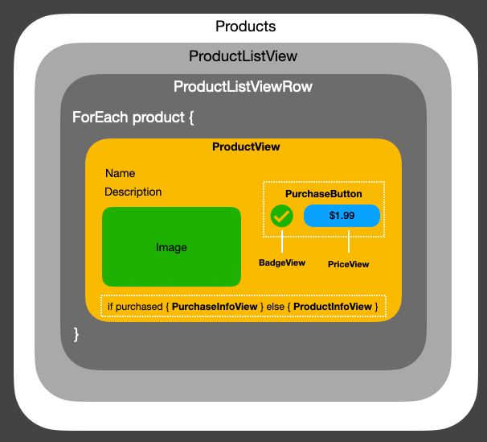

- The `ContentView` has a `List` which contains a collection of `ProductView` objects
- Each `ProductView` has an image of the product, the name of the product and a `PurchaseButton` 
- `PurchaseButton` contains a `BadgeView` and a `PriceView`
- `BadgeView` displays a small image showing the state of the purchase state of the product (i.e. purchased, failed, etc.)
- `PriceView` shows the localized price of the product as part of a purchase `Button`. When a product has been purchased the button is not displayed

## Adding support to StoreHelper
We now need to add support for purchasing to `StoreHelper`. The main things to add are:

- A `@Published` `Set` of `ProductId` that holds the ids of purchased products:

```swift
@Published private(set) var purchasedProducts = Set<ProductId>()
```

- A variable that holds the current state of purchasing:

```swift
public enum PurchaseState { case notStarted, inProgress, complete, pending, cancelled, failed, failedVerification, unknown }
public private(set) var purchaseState: PurchaseState = .notStarted
```

- A `purchase(_:)` method. Rather than call it directly from the UI, I moved the call to StoreKit's `product.purchase()` method into `StoreHelper`:

```swift
public func purchase(_ product: Product) async throws -> (transaction: Transaction?, purchaseState: PurchaseState)  { ... }
```

- A **task handle** and associated method that enables us to listen for App Store transactions. These transactions are things like resolution of "ask-to-buy" (pending) purchases, refunds, restoring purchases, etc.:

```swift
/// Handle for App Store transactions.
internal var transactionListener: Task<Void, Error>? = nil

init() {
    transactionListener = handleTransactions()
}

internal func handleTransactions() -> Task<Void, Error> { ... }
```

You can [browse the full code for `StoreHelper` on GitHub](https://github.com/russell-archer/StoreHelper/blob/main/Shared/StoreHelper/StoreHelper.swift).

We also need to add a **ViewModel** for `PriceView` named `PriceViewModel`:

```swift
import StoreKit
import SwiftUI

struct PriceViewModel {
    @ObservedObject var storeHelper: StoreHelper
    @Binding var purchasing: Bool
    @Binding var cancelled: Bool
    @Binding var pending: Bool
    @Binding var failed: Bool
    @Binding var purchased: Bool
    
    func purchase(product: Product) async {
        do {
            let purchaseResult = try await storeHelper.purchase(product)
            if purchaseResult.transaction != nil { 
                // Purchase appears to have been a success (we need to validate it)
                updatePurchaseState(newState: purchaseResult.purchaseState) } 
            else { 
                // The user cancelled, or it's pending approval
                updatePurchaseState(newState: purchaseResult.purchaseState) }
        } catch {            
            updatePurchaseState(newState: .failed)  // The purchase or validation failed
        }
    }
    
    private func updatePurchaseState(newState: StoreHelper.PurchaseState) {
    }
}
```

# Validating Transactions
A key point to note is how we **validate** transactions. Every time our app receives a transaction (e.g. when a purchase is made) from the App Store via `StoreKit`, the transaction has **already passed through a verification process** to confirm whether the transaction is signed by the App Store for **this app** for **this device**. 

> That is, `Storekit2` does **automatic** transaction ("receipt") verification for you. So, no more using OpenSSL to decrypt and read App Store receipts or sending receipts to an Apple server for verification! 
> 
> Note that the App Store cryptographically secures and signs each transaction using the industry-standard JSON Web Signature (`JWS`) format.  
> 
> The `Transaction` object provides access to the underling JWS as a `String` property, so you may perform your own validation if required (although this probably won't be necessary for most apps).
        
In our `StoreHelper.purchase(_:)` method, we call StoreKit's `product.purchase()` method and get a `PurchaseResult` back that indicates `success`, `userCancelled`, or `pending`. The call to `product.purchase()` may also throw an exception, which indicates that the purchase failed.

If the purchase seems to have succeeded (`PurchaseResult == .success`), `StoreKit2` has already automatically attempted to validate the transaction, returning the result of this validation wrapped in a `VerificationResult`.

We check the `VerificationResult<Transaction>` to see if the transaction passed or failed the verification process. This is equivalent to receipt validation in `StoreKit1`. 

If the verification process is a success we update our collection of purchased product ids and give the user access to the purchased product.

The simplified purchase process flow (showing mainly the "success" path) is as follows:


1. The user taps the `PriceView` button, which calls `PriceViewModel.purchase(product:)`, passing the `Product` to purchase

2. `PriceViewModel` calls `purchase(_:)` in `StoreHelper`, passing the `Product` to purchase
3. If there's already a purchase in progress, then a `StoreException.purchaseInProgressException` is thrown and caught by `PriceViewModel`
4. `StoreHelper` asynchronously calls `StoreKit.purchase(_:)` and awaits the result
5. `StoreKit2` leads the user through the purchase process and provides all the UI required
6. `StoreKit2` talks to the App Store to complete the purchase
7. The App Store completes the purchase and sends `StoreKit2` a purchase `Transaction` object
8. `StoreKit2` verifies that the purchase `Transaction` is correctly signed by the App Store and that the purchase is valid for the current user on the particular device in use. A `Product.PurchaseResult` is returned to `StoreHelper`. 
	- If `StoreKit2` encounters an error then a `StoreKitError` exception is thrown
	- If App Store encounters an error then a `PurchaseError`  exception is thrown
	- Any exceptions are caught by `StoreHelper`, which re-throws a `StoreException.purchaseException`. This will be caught by `PriceViewModel`
9. `StoreHelper` checks the `Product.PurchaseResult` returned by `StoreKit2`, if it's a success it...
10. ...checks the `VerificationResult` (which is wrapped up in the `PurchaseResult`). If this results in a valid `Transaction` then...
11. ... the collection of purchase product ids is updated to add the newly purchased product
12. `StoreHelper` tells `StoreKit2` the `Transaction` is finished and returns the `Transaction` object to `PriceViewModel`. It sets `@State` variables to show the purchase was a success and the UI is re-rendered


If we run the app we can now make purchases:

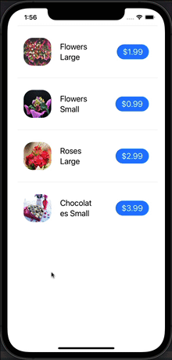

# Ask-to-buy support
The App Store supports the concept of "ask-to-buy" purchases, where parents can configure an Apple ID to require their permission to make a purchases. 
When a user makes this type of purchase the `PurchaseResult` returned by StoreKit's `product.purchase()` method will have a value of `.pending`. This
state can also be applicable when a user is required to make banking changes before a purchase is confirmed.

With `StoreKit` testing (which works with both `StoreKit1` and `StoreKit2`) we can easily simulate pending purchases to see if our app correctly supports them.

To enable ask-to-buy support in `StoreKit` select the `.storekit` configuration file and then select **Editor > Enable Ask To Buy**:

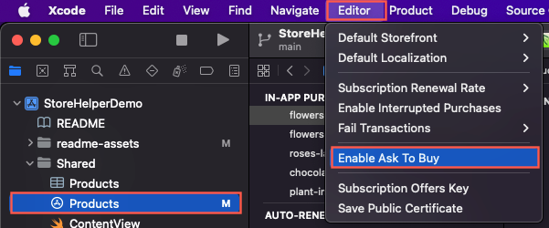

Now run the app and attempt to make a purchase. You'll find that the purchase proceeds as normal. 
However, instead of receiving a purchase confirmation you'll see an **Ask Permission** alert. 

Tap **Ask** and you'll see that the purchase enters a `.pending` state, as denoted by the orange hourglass next to the product purchase button:

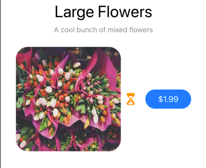

With the app still running, click the **Manage StoreKit Transaction** button on the Xcode debug area pane:


You'll now be able to see the transaction that is "Pending Approval":


Right-click the transaction that is pending approval and select **Approve Transaction**:


You should see the purchase confirmed as `StoreHelper` processes the transaction:


# What Products has the user purchased?
Everything seems to be working well. However, what happens if we quit and restart the app. How do we know what purchases the user has previously made?

If you stop and re-run the app you'll see that without any work on our part it seems to remember what's been purchased. This is because the UI calls `StoreHelper.isPurchased(product:)` for each product when it's displayed. This checks the `StoreKit2` `Transaction.currentEntitlement(for:)` property to get a list of transactions for the user. This includes non-consumable in-app purchases and active subscriptions.

But hang on a minute, isn't there a potential problem here? Doesn't `StoreKit2` have to check with the App Store to confirm a user's transactions and entitlements? What happens when the network is unavailable and the App Store can't be reached? In that case, do we need to have some kind of "backup" collection of purchases (product ids) that gets persisted and can be used when the App Store's not available?

# Use the Receipt, Luke
Happily, we don't need a backup collection of purchased product ids because we can always refer to the single source of truth: the **receipt** issued by the App Store, which is stored *on the device* in the app's **main bundle**. The receipt contains a complete record of a user's in-app purchase history for that app.

When an app is installed (or re-installed) the App Store issues a receipt at the same time which *includes any previous transactions*. That is, purchases made by the user previously on the same device, or purchases made on another device belonging to the same user (i.e. using the same Apple ID). 

This is a change from how things worked previously with `StoreKit1` where, in order to sync with the App Store and receive an up-to-date receipt, the user would have to "restore" previous purchases. With `StoreKit2`, users don't need to restore previous transactions when your app is installed/reinstalled. 

- `StoreKit1` 
	- The receipt is a **signed** and **encrypted file**
	- Stored in the app's main bundle
	- The location of the receipt is given by `Bundle.main.appStoreReceiptURL`
	- See https://github.com/russell-archer/IAPHelper for details on reading and validating the receipt with `StoreKit1`

- `StoreKit2`
	- The receipt is a **SQLite database** (`receipts.db`)
	- Contains all of the user's transactions

So, just out of interest, where is the receipt database and can we look at its contents?!

Unless you jailbreak your iPhone you can't view the receipts database on a real device. However, when using the simulator you **can** directly view the contents of the database. The easiest way to find the path to the database is to add the following print statement somewhere in your app:

```swift
print("StoreKit1 receipt is here: \(Bundle.main.appStoreReceiptURL!)")
```

This gives you URL of the `StoreKit1` receipt. It will be something like:

```bash
/Users/rarcher/Library/Developer/CoreSimulator/Devices/{device-id}/data/Containers/Data/Application/{app-id}/StoreKit/receipt
```

The `receipt` directory will contain the old-style `StoreKit1` encrypted receipt. 

If you navigate to `...{app-id}/Library/Caches/StoreKit` you should see the `StoreKit2` receipts database:

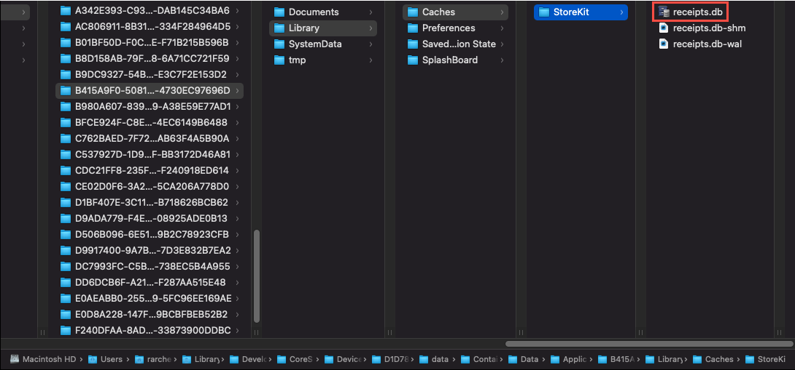

If you have a SQLite client installed (I used **SQLPro for SQLite**) you can open the database. Here's what it looks like having made two purchases:


We can immediately see how each transaction is structured, with the `product_id` column showing the `ProductId` of the purchase. 
The `receipt` column is a plain text field where the contents are clearly encrypted:


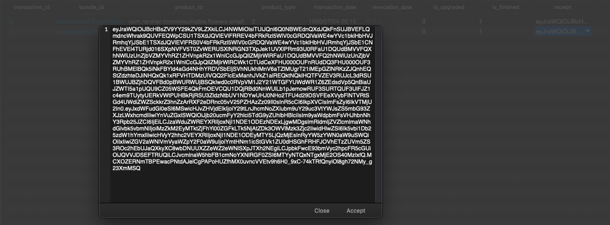

So, because we know an up-to-date version of the receipts database will always be present, we can always use it (via `StoreKit2`) to find out a user's product entitlements.

# Consumables
Now we have the basics of the app working we can move onto adding another type of product: consumables.

Consumables are products that are used once, or for a limited time and then expire. If the user wants to use the product again they need to re-purchase. A typical consumable product would be a token in game that temporarily gives you more lives or higher powers. Once the token's used up the user would lose the abilities it confers.

We'll add a consumable called "VIP plant installation service". It lasts for one appointment and then expires.

Open the `Products.storekit` file and click the **+** at the bottom-left of the window to add a consumable:


We define the product like this:

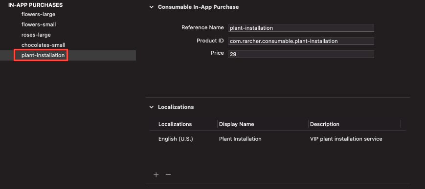

Now add the new product to Products.plist:

```xml
<?xml version="1.0" encoding="UTF-8"?>
<!DOCTYPE plist PUBLIC "-//Apple//DTD PLIST 1.0//EN" "http://www.apple.com/DTDs/PropertyList-1.0.dtd">
<plist version="1.0">
<dict>
    <key>Products</key>
    <array>
        <string>com.rarcher.nonconsumable.flowers-large</string>
        <string>com.rarcher.nonconsumable.flowers-small</string>
        <string>com.rarcher.nonconsumable.roses-large</string>
        <string>com.rarcher.nonconsumable.chocolates-small</string>
        <string>com.rarcher.consumable.plant-installation</string>
    </array>
</dict>
</plist>
```

Next, add an image for the new product to the asset catalog:


Running the app shows the new product:


Everything seems to work. However, we're not distinguishing between consumable and non-consumable products either visually or in our code.

First, let's update `StoreHelper` by adding two new computed properties `consumableProducts` and `nonConsumableProducts`:

```swift
public class StoreHelper: ObservableObject {
    
    /// Array of `Product` retrieved from the App Store and available for purchase.
    @Published private(set) var products: [Product]?
    
    public var consumableProducts: [Product]? { products?.filter { $0.type == .consumable }}
    public var nonConsumableProducts: [Product]? { products?.filter { $0.type == .nonConsumable }}
```

As you can see we filter the `products` array to return only products of a specific type using `Product.type`.

Now we'll update the UI in `ContentView`:

```swift
struct ContentView: View {
    @StateObject var storeHelper = StoreHelper()
    var body: some View {
        if storeHelper.hasProducts {
            List {
                if let nonConsumables = storeHelper.nonConsumableProducts {
                    Section(header: Text("Products")) {
                        ForEach(nonConsumables, id: \.id) { product in
                            ProductView(storeHelper: storeHelper,
                                        productId: product.id,
                                        displayName: product.displayName,
                                        price: product.displayPrice)
                        }
                    }
                }
                if let consumables = storeHelper.consumableProducts {
                    Section(header: Text("Services")) {
                        ForEach(consumables, id: \.id) { product in
                            ProductView(storeHelper: storeHelper,
                                        productId: product.id,
                                        displayName: product.displayName,
                                        price: product.displayPrice)
                        }
                    }
                }
            }
            .listStyle(.insetGrouped)
            
        } else {
            Text("No products available")
                .font(.title)
                .foregroundColor(.red)
        }
    }
}
```

We create a grouped `List` and iterate through products in a `ForEach` loop. The `\.id` in the loop references the product's `ProductId`. 

Running the app produces:


If we try to purchase the "Plant Installation" consumable product it seems to work (and the transaction succeeds). However, the price button doesn't change to a green tick. The reason for this is in the `StoreHelper.isPurchased(productId:)` method:

```swift
public func isPurchased(productId: ProductId) async throws -> Bool {
    guard let currentEntitlement = await Transaction.currentEntitlement(for: productId) else {
        return false  // There's no transaction for the product, so it hasn't been purchased
    }
}
```

We're checking for transactions for the consumable but none are found. How can this be?! 

The reason is simple and non-obvious:

> Transactions for consumable products ARE NOT STORED IN THE RECEIPT!

The rationale for this from Apple's perspective is that consumables are "ephemeral". To quote Apple's documentation (https://developer.apple.com/documentation/storekit/transaction/3851204-currententitlements) for `Transaction.currentEntitlement(for:)`:

> The current entitlements sequence emits the latest transaction for each product the user is currently entitled to, specifically: 
> - A transaction for each consumable in-app purchase that you have not finished by calling `finish()`

In tests I've done transactions for consumables do not remain in the receipt, even if you omit to call `finish()`.

So, if you plan to sell consumable products in your own apps you'll need to create some sort of system for keeping track of them. This could be as simple as storing data in `UserDefaults`. However, for greater security use either the keychain or a database as part of your backend solution.

For the purposes of this demo we'll use a Keychain-based system that simply keeps a count of each purchase of a consumable product. Each time the consumable is purchased the count is incremented. When a purchase is "expired" the count is decremented. When the count reaches zero the user no longer has access to the product.

Here's a helper class for that:

```swift
import Foundation
import Security

/// A consumable product id and associated count value.
public struct ConsumableProductId: Hashable {
    let productId: ProductId
    let count: Int
}

/// KeychainHelper provides methods for working with collections of `ConsumableProductId` 
/// in the keychain.
public struct KeychainHelper {
    public static func purchase(_ productId: ProductId) -> Bool { ... }
    public static func expire(_ productId: ProductId) -> Bool { ... }
    public static func has(_ productId: ProductId) -> Bool { ... }
    public static func count(for productId: ProductId) -> Int { ... }
    public static func update(_ productId: ProductId, purchase: Bool) -> Bool { ... }
    public static func delete(_ consumableProduct: ConsumableProductId) -> Bool  { ... }
}
```

We also need to make a few changes in `StoreHelper:`

```swift
public func isPurchased(productId: ProductId) async throws -> Bool {
    guard let product = product(from: productId) else { return false }
    
    // We need to treat consumables differently because their transaction are NOT stored in the receipt.
    if product.type == .consumable {
        await updatePurchasedIdentifiers(productId, insert: true)
        return KeychainHelper.count(for: productId) > 0
    }
}

@MainActor private func updatePurchasedIdentifiers(_ productId: ProductId, insert: Bool) async {
    guard let product = product(from: productId) else { return }
    
    if insert {
        if product.type == .consumable {
            let count = count(for: productId)
            let products = purchasedProducts.filter({ $0 == productId })
            if count == products.count { return }
        } else {
            if purchasedProducts.contains(productId) { return }
        }
        
        purchasedProducts.append(productId)
        
    } else {
        if let index = purchasedProducts.firstIndex(where: { $0 == productId}) {
            purchasedProducts.remove(at: index)
        }
    }
}

extension StoreHelper {
    public func count(for productId: ProductId) -> Int {
        if let product = product(from: productId) {
            if product.type != .consumable { return 0 }
            return KeychainHelper.count(for: productId)
        }
        
        return 0
    }
    
    public func resetKeychainConsumables() {
        guard products != nil else { return }
        
        let consumableProductIds = products!.filter({ $0.type == .consumable}).map({ $0.id })
        guard let cids = KeychainHelper.all(productIds: Set(consumableProductIds)) else { return }
        cids.forEach { cid in
            if KeychainHelper.delete(cid) {
                Task.init { await updatePurchasedIdentifiers(cid.productId, insert: false) }
            }
        }
    }
}
```

We also introduce a `ConsumableView` that displays a count of the number of unexpired purchases of the consumable product the user has:

```swift
import SwiftUI
import StoreKit

struct ConsumableView: View {
    @EnvironmentObject var storeHelper: StoreHelper
    @State var count: Int = 0
    
    var productId: ProductId
    var displayName: String
    var price: String
    
    var body: some View {
        HStack {
            if count == 0 {
                Image(productId)
                    .resizable()
                    .frame(width: 75, height: 80)
                    .aspectRatio(contentMode: .fit)
                    .cornerRadius(25)
            } else {
                Image(productId)
                    .resizable()
                    .frame(width: 75, height: 80)
                    .aspectRatio(contentMode: .fit)
                    .cornerRadius(25)
                    .overlay(Badge(count: $count))
            }
            Text(displayName)
                .font(.title2)
                .padding()
                .lineLimit(2)
                .minimumScaleFactor(0.5)
            Spacer()
            PurchaseButton(productId: productId, price: price)
        }
        .padding()
        .onAppear {
            count = storeHelper.count(for: productId)
        }
        .onChange(of: storeHelper.purchasedProducts) { _ in
            count = storeHelper.count(for: productId)
        }
    }
}

struct Badge : View {
    @Binding var count : Int
	
    var body: some View {
        ZStack {
            Capsule()
                .fill(Color.red)
                .frame(width: 30, height: 30, alignment: .topTrailing)
                .position(CGPoint(x: 70, y: 10))
            
            Text(String(count)).foregroundColor(.white)
                .font(Font.system(size: 20).bold()).position(CGPoint(x: 70, y: 10))
        }
    }
}
```

If you purchase a consumable the app now looks like this:

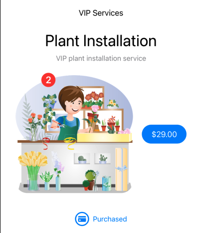

And if you purchase the product again:


# Subscriptions
Subscriptions are an important class of in-app purchase that are becoming more and more widely used by developers. 

In our demo app we'll create a group of auto-renewable subscriptions (Apple discourages the use of the older non-renewing subscriptions) for a "VIP Home Plant Care Visit". The subscription offers three different levels of service: Gold, Silver and Bronze.

Open `Products.storekit` and click the **+** to add a new auto-renewable subscription:


The first thing you need to do is define a subscription group. We'll name our group "VIP":


You can then define the products within the group. 
Notice how we adopt the following naming convention for our subscription products:

```xml
com.{developer}.subscription.{subscription-group-name}.{product-name}"
```


To create subsequent products, click the **+** to add a new auto-renewable subscription. You'll then be offered the choice of adding a new product within the existing group or creating a new group. Select the "VIP" group:


Finally, create the third subscription:


The **order** in which products are defined in both `Products.storekit` and `Products.plist` is important. As we'll discuss shortly, we need to be able to distinguish the service level of a product within a subscription group. For this reason, the product with the highest service level is defined at the top of the group, with products of decreasing service level placed below it.

Here's how our products should look in `Products.storekit`. Notice the "gold" product is at the top of the list and we've assigned a level value of 1 to it:

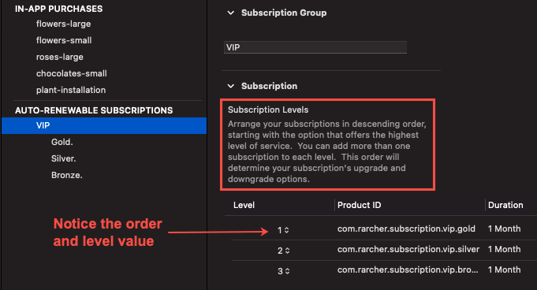

Update `Products.plist` with the same product ids and order:

```xml
<?xml version="1.0" encoding="UTF-8"?>
<!DOCTYPE plist PUBLIC "-//Apple//DTD PLIST 1.0//EN" "http://www.apple.com/DTDs/PropertyList-1.0.dtd">
<plist version="1.0">
<dict>
    <key>Products</key>
    <array>
        <string>com.rarcher.nonconsumable.flowers-large</string>
        <string>com.rarcher.nonconsumable.flowers-small</string>
        <string>com.rarcher.nonconsumable.roses-large</string>
        <string>com.rarcher.nonconsumable.chocolates-small</string>
        <string>com.rarcher.consumable.plant-installation</string>
        <string>com.rarcher.subscription.vip.gold</string>
        <string>com.rarcher.subscription.vip.silver</string>
        <string>com.rarcher.subscription.vip.bronze</string>
    </array>
</dict>
</plist>
```

We can now update `StoreHelper` and `ContentView`:

```swift
/// Computed property that returns all the auto-renewing subscription products 
/// in the `products` array.
public var subscriptionProducts: [Product]? {
    guard products != nil else { return nil }
    return products!.filter { product in product.type == .autoRenewable }
}
```

```swift
struct ContentView: View {
    @StateObject var storeHelper = StoreHelper()
    var body: some View {
        if storeHelper.hasProducts {
            List {

                if let subscriptions = storeHelper.subscriptionProducts {
                    Section(header: Text("Subscriptions")) {
                        ForEach(subscriptions, id: \.id) { product in
                            ProductView(storeHelper: storeHelper,
                                        productId: product.id,
                                        displayName: product.displayName,
                                        price: product.displayPrice)
                        }
                    }
                }
            }
            .listStyle(.insetGrouped)
            
        } else { ... }
    }
}
```

At this point it's probably also a good idea to stop creating an instance of `StoreHelper` in `ContentView` and manually passing it down to child views. Instead, we'll create it in the `App` and use the environment to automatically pass the object down through the view hierarchy:

```swift
@main
struct StoreHelperApp: App {
    // Create the StoreHelper object that will be shared throughout the View hierarchy...
    @StateObject var storeHelper = StoreHelper()
    
    var body: some Scene {
        WindowGroup {
            ContentView()
                .environmentObject(storeHelper)  // ...and add it to ContentView
        }
    }
}
```

Now in views we reference the instance of `StoreHelper` using `@EnvironmentObject`:

```swift
struct ContentView: View {
    // Access the storeHelper object that has been created by @StateObject in StoreHelperApp
    @EnvironmentObject var storeHelper: StoreHelper
```

We can now modify all calls to child views where we've been directly passing in `storeHelper` and add `@EnvironmentObject var storeHelper: StoreHelper` to each child view that requires it. 

> One point to remember is that an the SwiftUI environment is intended to provide an `ObservableObject` to a ***view*** hierarchy. 
> 
> This means that an `ObservableObject` referenced with `@EnvironmentObject` in a `View` **will NOT** be automatically passed to that view's `ViewModel`. In this case you need to pass (inject) the object dependency to the ViewModel's initializer. See `PriceView` and `PriceViewModel`.

After adding some image assets for the new subscriptions, the app looks like this:


And subscription purchasing works correctly too:


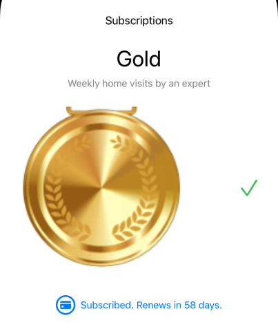

Notice that when we purchase the "Gold" subscription we can see that we'll be charged a trial rate of $9.99 for two months, a then $19.99 per month thereafter.

However, there are a few things missing, For example, once a purchase has been completed there's no information displayed on when the purchase was made, and in the case of a subscription, how long does it last, when does it renew and how much does it cost? Also, how does the user upgrade, downgrade or cancel a subscription?

Let's fix that. 

# Displaying Non-Consumable Purchase Information
Getting purchase information for non-consumables is very straightforward. The `latestTransaction` property of a `Product` gives you a `VerificationResult<Transaction>` for the most recent transaction on the product:

```swift
// If nil the product has never been purchased
guard let unverifiedTransaction = await product.latestTransaction else { ... }
```

`VerificationResult<Transaction>` is the result of StoreKit's attempt to verify the transaction. You can unwrap it and gain access to the `Transaction` object with a call to `StoreHelper.checkVerificationResult(result:)`:

```swift
let transactionResult = checkVerificationResult(result: unverifiedTransaction)
guard transactionResult.verified else { ... }
```

If `StoreKit2` verified the transaction then we can access the date when the purchase was made:

```swift
if product.type == .nonConsumable {    
    let datePurchased = transactionResult.transaction.purchaseDate
}
```

The `StoreHelper.purchaseInfo(for:)` method is used to gather the required purchase information:

```swift
public class StoreHelper: ObservableObject {

    @MainActor public func purchaseInfo(for product: Product) async -> PurchaseInfo? {
        guard product.type == .nonConsumable else { return nil }
        var purchaseInfo = PurchaseInfo(product: product)
        guard let unverifiedTransaction = await product.latestTransaction else { return nil }
        let transactionResult = checkVerificationResult(result: unverifiedTransaction)
        guard transactionResult.verified else { return nil }
        
        purchaseInfo.latestVerifiedTransaction = transactionResult.transaction
        return purchaseInfo
    }
}
```

The struct returned by `StoreHelper.purchaseInfo(for:)` is used to neatly package purchase information in a read-to-use format:

```swift
public struct PurchaseInfo {
    /// The product.
    var product: Product

    /// The most recent unwrapped StoreKit-verified transaction for a non-consumable. nil if verification failed.
    var latestVerifiedTransaction: Transaction?
}
```

A new `PurchaseInfoView` and `PurchaseInfoViewModel` handles the display of non-consumable purchase data:

```swift
struct PurchaseInfoView: View {
    @EnvironmentObject var storeHelper: StoreHelper
    @State var purchaseInfoText = ""
    var productId: ProductId
    
    var body: some View {
        let viewModel = PurchaseInfoViewModel(storeHelper: storeHelper, productId: productId)
        
        HStack(alignment: .center) {
            Text(purchaseInfoText)
                .font(.footnote)
                .foregroundColor(.blue)
                .lineLimit(nil)
                .fixedSize(horizontal: false, vertical: true)
                .padding(1)
        }
        .onAppear {
            Task.init { purchaseInfoText = await viewModel.info(for: productId) }
        }
    }
}
```

```swift
struct PurchaseInfoViewModel {
    
    @ObservedObject var storeHelper: StoreHelper
    var productId: ProductId
    
    @MainActor func info(for productId: ProductId) async -> String {
        guard let product = storeHelper.product(from: productId) else { return "No purchase info available." }
        guard product.type != .consumable, product.type != .nonRenewable else { return "" }
        
        // Get detail purchase/subscription info on the product
        guard let info = await storeHelper.purchaseInfo(for: product) else { return "" }
        
        var text = ""
        let dateFormatter = DateFormatter()
        dateFormatter.dateFormat = "d MMM y"
        
        if info.product.type == .nonConsumable {
            guard let transaction = info.latestVerifiedTransaction else { return "" }
            
            text = "Purchased on \(dateFormatter.string(from: transaction.purchaseDate))."
            if transaction.revocationDate != nil {
                text += " Revoked on \(dateFormatter.string(from: transaction.revocationDate!))."
            }
        }
        
        return text
    }
}
```

We also introduce a "hamburger menu" that allows us to display various useful options:


# Displaying Subscription information
Displaying information on what product a user is subscribed to, when it renews, how much it costs, and so on is not *quite* as straightforward as it first appears. For example, what happens when a user is subscribed to one level of service and then purchases a higher service level product? The user will expect immediate access to a higher level of service, but how can we tell which subscription is "current"? 

Let's walk through the flow of gathering subscription data.

The key point to note is that, unlike getting purchase info about a non-consumable product, with subscriptions you have to consider the entire subscription **group** of products as a whole. This is because a user can be subscribed to **multiple products** at the same time in the same subscription group! 

For example, this can happen when the user is automatically entitled to one level of service through family sharing, and then pays for a subscription to another product at a higher level of service in the same group. 

`StoreKit2` provides a collection of subscription statuses (`[Product.SubscriptionInfo.Status]`) for the subscription group which contains all the information we need. We can access this collection via the `product.subscription.status` property of *any* `Product` in the subscription group (it's the same array in each product). 

Essentially, we enumerate all the statuses in order to find the subscription product that the user's subscribed to which has the highest service level. That is, we find "the best" subscription product the user's entitled to.

The `StoreHelper.subscriptionInfo(for:)` method performs the required processing and returns a `SubscriptionInfo` struct the summarizes the information we need to display to the user:

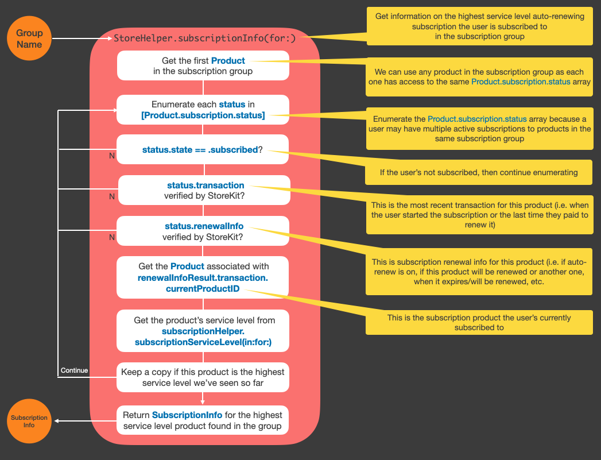

We return the data in a `SubscriptionInfo` object that neatly packages everything required in one easy-to-use `struct`:

```swift
/// Information about the highest service level product in a subscription group a user 
/// is subscribed to.
public struct SubscriptionInfo: Hashable {
    /// The product.
    var product: Product?
    
    /// The name of the subscription group `product` belongs to.
    var subscriptionGroup: String?
    
    /// The most recent StoreKit-verified purchase transaction for the subscription. nil if verification failed.
    var latestVerifiedTransaction: Transaction?
    
    /// The StoreKit-verified transaction for a subscription renewal. nil if verification failed.
    var verifiedSubscriptionRenewalInfo:  Product.SubscriptionInfo.RenewalInfo?
    
    /// Info on the subscription.
    var subscriptionStatus: Product.SubscriptionInfo.Status?
}
```

Of course, we could just return the highest `Product.SubscriptionInfo.Status` we find in the subscription group. However, this would mean the caller would have to re-check and unwrap the transaction and renewal information.

The key objects accessible via `SubscriptionInfo` are as follows:

- `SubscriptionInfo.subscriptionStatus.state`
An enum that tells you if the subscription is `.subscribed`, `.revoked`, `.expired`, etc.

- `SubscriptionInfo.product.subscription`
Provides access to `subscriptionPeriod.unit` and `subscriptionPeriod.value` which enables you to work out how often the subscription renews.

- `SubscriptionInfo.verifiedSubscriptionRenewalInfo`
Allows you to see if the subscription will auto-renew, if the current product will be renewed or the user upgraded/downgraded the product so that a different product will be renewed at the end of the current subscription period, the `expirationDate` of subscription, etc.

- `SubscriptionInfo.latestVerifiedTransaction`
Tells you if the product has been upgraded, the purchase date, etc. 

We introduce `SubscriptionListViewRow`, `SubscriptionView`, `SubscriptionViewModel` and `SubscriptionInfoView`. As you can see from the arrangement of views in schematic below, `SubscriptionListViewRow` gathers all the subscription data and then uses `SubscriptionView` to display each subscription. `SubscriptionViewModel` is used to format text for display using the raw `SubscriptionInfo` data:


```swift
import SwiftUI
import StoreKit
import OrderedCollections

struct SubscriptionListViewRow: View {
    @EnvironmentObject var storeHelper: StoreHelper
    @State private var subscriptionGroups: OrderedSet<String>?
    @State private var subscriptionInfo: OrderedSet<SubscriptionInfo>?
    var products: [Product]
    var headerText: String
    
    var body: some View {
        Section(header: Text(headerText)) {
            // For each product in the group, display as a row using SubscriptionView().
            // If the product is the highest subscription level then pass SubscriptionInfo to SubscriptionView().
            ForEach(products, id: \.id) { product in
                SubscriptionView(productId: product.id,
                                 displayName: product.displayName,
                                 description: product.description,
                                 price: product.displayPrice,
                                 subscriptionInfo: subscriptionInformation(for: product))
            }
        }
        .onAppear { getGroupSubscriptionInfo() }
        .onChange(of: storeHelper.purchasedProducts) { _ in getGroupSubscriptionInfo() }
    }
    
    /// Gets all the subscription groups from the list of subscription products.
    /// For each group, gets the highest subscription level product.
    func getGroupSubscriptionInfo() {
        subscriptionGroups = storeHelper.subscriptionHelper.groups()
        if let groups = subscriptionGroups {
            subscriptionInfo = OrderedSet<SubscriptionInfo>()
            Task.init {
                for group in groups {
                    if let hslp = await storeHelper.subscriptionInfo(for: group) { subscriptionInfo!.append(hslp) }
                }
            }
        }
    }
    
    /// Gets `SubscriptionInfo` for a product.
    /// - Parameter product: The product.
    /// - Returns: Returns `SubscriptionInfo` for the product if it is the highest service level product
    /// in the group the user is subscribed to. If the user is not subscribed to the product, or it's
    /// not the highest service level product in the group then nil is returned.
    func subscriptionInformation(for product: Product) -> SubscriptionInfo? {
        if let subsInfo = subscriptionInfo {
            for subInfo in subsInfo {
                if let p = subInfo.product, p.id == product.id { return subInfo }
            }
        }
        
        return nil
    }
}
```

# Upgrades
So, what happens when the user attempts to upgrade?

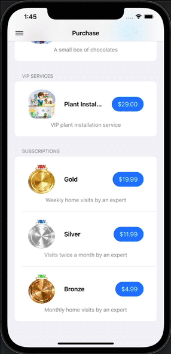

When the user upgrades from the "Silver" subscription to "Gold" StoreKit and the App Store:

- Flag the latest silver transaction as upgraded (which is why it doesn't show up as purchased any more - see `isPurchased(productId:)`
- Provide a refund to the user for the remaining time left on the upgraded silver subscription
- Create a new transaction for the subscription to gold

If required, we could display a note in the silver product that it had been upgraded.

# Managing Subscriptions
If a you wants to see what subscriptions you have you can do so via **Settings > AppleID > Subscriptions**. From here you can view, upgrade, downgrade, or cancel subscriptions.

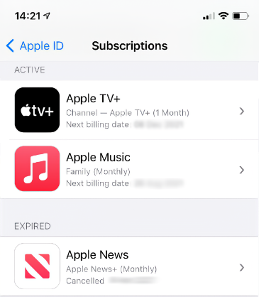

You can also manage subscriptions from your Mac using the **App Store** app. See https://support.apple.com/en-us/HT202039 for more details. 

However, the problem with this approach is that many user's don't think to look in settings to cancel a subscription. It seems that a commonly held belief is that if you simply delete an app from your phone this will automatically cancel any associated subscriptions.

What's required is some way of managing subscriptions from *within* the app.

With iOS 15 we can now display the same subscriptions sheet using the `.manageSubscriptionsSheet(isPresented:)` view modifier. This will show the current subscriptions for your app:

```swift
struct OptionsView: View {
    @State private var showManageSubscriptions = false
    var body: some View {
        VStack { ... }
        .manageSubscriptionsSheet(isPresented: $showManageSubscriptions)  
        // *** DOESN'T WORK WITH XCODE STOREKIT TESTING. MUST USE SANDBOX ***
    }
}
```

The only drawback with this approach is that it doesn't (yet) work with StoreKit testing in Xcode, so you have to test it in the sandbox environment. See [Human Interface Guidelines - Helping People Manage Their Subscriptions](https://developer.apple.com/design/human-interface-guidelines/in-app-purchase/overview/auto-renewable-subscriptions/#helping-people-manage-their-subscriptions) for more details.

# Refunds
Another issue that has been a source of annoyance for many years is the ability to issue users with a refund. The only resources available for developers are App Store support, via a [support article](https://support.apple.com/en-us/HT204084), or Apple's [dedicated refund website](https://reportaproblem.apple.com/?s=6).

In iOS 15 we now have the ability to display a refund request sheet from within our apps. The refund sheet shows the user’s transaction details, along with a list of "why I want a refund" codes for the customer to choose from. 

> Note that developers don't have the ability to ***grant*** the user a refund, but simply the means to *initiate* the refund request process with Apple on the user's behalf.

The following shows how you'd display the refund request sheet:

```swift
    /// Presents the refund request sheet for a transaction in a window scene.
    ///
    /// Note that this will not work in the Xcode StoreKit Testing environment:
    /// you must use the sandbox environment.
    /// - Parameter productId: The `ProductId` for which the user wants to request a refund.
    func requestRefund(productId: ProductId) {
        guard let keyWindow = UIApplication.shared.connectedScenes
                                                  .filter({$0.activationState == .foregroundActive})
                                                  .map({$0 as? UIWindowScene})
                                                  .compactMap({$0})
                                                  .first?.windows
                                                  .filter({$0.isKeyWindow}).first,
              let scene = keyWindow.windowScene else { return }

        Task.init {
            if let result = await Transaction.latest(for: productId) {
                let verificationResult = storeHelper.checkVerificationResult(result: result)
                if verificationResult.verified {
                    if let status = try? await verificationResult.transaction.beginRefundRequest(in: scene), status == .success {
                        StoreLog.event(.transactionRefundRequested)
                    } else {
                        StoreLog.event(.transactionRefundFailed)
                    }
                }
            }
        }
    }
```

Apple normally responds to the user within 48 hours of a refund request.

More details are available in the WWDC21 video [Support customers and handle refunds](https://developer.apple.com/videos/play/wwdc2021/10175/#:~:text=We%20are%20now%20introducing%20a,notification%20from%20the%20App%20Store).

